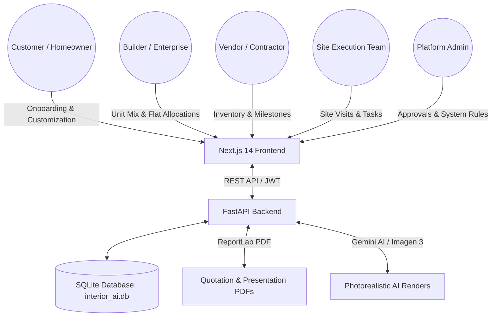

# Project: InteriorAI

**InteriorAI** is an end-to-end AI-powered interior design and modular execution platform. It unifies 5 distinct stakeholder portals into a single web platform: Homeowners (B2C), Real-Estate Builders (B2B2C Enterprise), Furniture & Decor Vendors (B2B), Site Operations & Execution Teams, and Platform Administrators.

---

## System Architecture

The application is built as a Next.js single-page application frontend and a FastAPI backend using SQLAlchemy and a SQLite database.



### Main Directories
* [`/frontend`](file:///d:/MyFiles/Interior_Design/frontend): Next.js 14 application built with TypeScript, React 18, Zustand, and Tailwind CSS.
* [`/backend`](file:///d:/MyFiles/Interior_Design/backend): Python REST API built with FastAPI, SQLAlchemy, and SQLite.
* [`/backend/pdfs/catalog`](file:///d:/MyFiles/Interior_Design/backend/pdfs/catalog): Visual product assets, thumbnails, laminate textures, and multi-view catalog images.
* [`/backend/pdfs/floor_plans`](file:///d:/MyFiles/Interior_Design/backend/pdfs/floor_plans): Uploaded customer floor plan layout blueprints.

---

## Core Workflows Across 5 Stakeholder Portals

### 1. Customer (B2C) Onboarding & Design Flow
1. **6-Step Onboarding**:
   * **Project Type**: New Home vs. Upgrade (renovation).
   * **Scope & BHK**: Select house configuration (1 BHK to 5 BHK).
   * **Budget & Timeline**: Select total budget limit and completion timeline.
   * **Design Vibe**: Single-selection style cards (Modern, Scandinavian, Indian Contemporary, Luxury, Mediterranean, Boho).
   * **Material & Fabric**: Select wood laminate finish (Oak, Teak, Walnut) and fabric preference (Linen, Velvet, Woven, Leatherette).
   * **Colors Explorer**: Interactive color family selection.
2. **Dynamic Package Selection**:
   * Packages filter dynamically by BHK and budget limit (`Basic` = budget, `Premium` = budget + ₹2L, `Luxury` = budget + ₹5L).
3. **Room Customization**:
   * Customize individual products room-by-room.
   * Live price tracking displays Base Price, Current Cost, and Variation in dual centered sub-boxes (*Remaining Budget* and *Variation Spent*).
   * Mandatory product completeness checklist per room; Balcony rooms automatically bypass completeness checks.
   * Switch to next room tab automatically upon selecting last category item.
   * Configuration Complete panel swaps product grid once all rooms are customized.
4. **4-Wall AI Renders**:
   * Visualizer studio displaying Wall A, B, C, and D perspectives.
   * Supports blueprint templates, custom photo uploads, and room dimension inputs.
   * Generates photorealistic AI images via Gemini / Imagen 3 / SDXL simulation.
5. **Quotation & Verification**:
   * Generates professional bank-compliant PDF quotes. Automatically regenerates quotes if customer revises items after review.
   * Dual horizontal tracking bars visualizes item sourcing status (Ordered to Dispatched) and customer verification bar (Confirm Delivery / Installation).

### 2. Enterprise / Builder (B2B2C) Flow
1. **Parent-Child Project Creation**: 4-step wizard setting up parent property, unit mix (1BHK-5BHK distribution), and default packages.
2. **Flat Allocation & Invitation**: Generate unique invitation tokens and assign customer details (name, email, phone) to specific flat units.
3. **Buyer Journey Handoff**: Customers accept invitation token via `/invite`, automatically creating a child project linked to their assigned flat.
4. **Portfolio Dashboard**: Tracks overall portfolio completion metrics, flat allocation statuses, and recent project activity.

### 3. Vendor (B2B) Portal Flow
1. **Onboarding & Document Verification**: Register business profile, submit GST/PAN numbers, and upload verification documents.
2. **Multi-View Catalog Management**: Manage product inventory and upload up to 3 perspective images (Front, Side, Perspective).
3. **Assignment Fulfillment**: Receive assigned project items, update 6-stage milestone progress (PO Approved $\rightarrow$ Production $\rightarrow$ Ready $\rightarrow$ Dispatched), upload proof photos, and enter shipping logistics details.
4. **Issues & Milestone Payouts**: Review customer-reported product issues (`/vendor/issues`) and track milestone-based vendor payout releases.

### 4. Project Team / Site Execution Flow
1. **Welcome Portal & Role Router**: Access workspace at `/team` to select role (`team_manager`, `team_coordinator`, `team_technician`).
2. **Dedicated Role Dashboards**:
   * **Manager Console (`/team/manager`)**: Portfolio metrics, team utilization rates, SLA performance analytics, resource assignment controls.
   * **Coordinator Console (`/team/coordinator`)**: Assigned projects, sourcing status tracking, vendor delay alerts, site visit scheduling, daily checklist forms.
   * **Technician Field Console (`/team/technician`)**: Assigned installation items, daily checklists, direct proof photo uploads with multipart form support.
3. **Execution Workspaces & Timeline**: Project workspace at `/projects/[projectId]/execution` with item tracking, tasks, site visit logs, document vault, and customer call logs.

### 5. Admin Portal Flow
1. **Admin Control Hub & Layout**: Main dashboard at `/admin` with unified sidebar navigation across 10 specialized sub-routes.
2. **Modular Admin Sub-Pages**:
   * **Client CRM (`/admin/customers`)**: Directory of customers, profile editing, account suspension, and reactivation.
   * **Vendor Governance (`/admin/vendors`)**: Onboarding application review, document inspection, approval, rejection, and vendor suspension.
   * **Team Onboarding & Approvals (`/admin/project-team`)**: Pending team registration approvals and role matrix assignment controls (`AdminRole`).
   * **Project Control Center (`/admin/projects`)**: Project creation, team & vendor resource assignments, closing, and cancellation.
   * **Master Data Management (`/admin/master-data`)**: Product catalog CRUD, CSV bulk import, and CSV export.
   * **Reports & Operational CSV Exports (`/admin/reports`)**: Live CSV report generation for sales, revenue, projects, vendors, and customers.
   * **AI Engine Customization (`/admin/ai-engine`)**: AI model selection, rendering parameters, and prompt tuning templates.
   * **IT Box & System Settings (`/admin/settings`)**: Dynamic platform key-value settings management (`SystemSetting`).
   * **Audit Trail & System Logs (`/admin/audit-log` & `/admin/activity-log`)**: Full administrative action logs (`AuditLog`) and real-time developer activity stream.

---

## Dynamic Platform Constraints (Phase 9 & 10)

### 1. Dynamic Package Pricing
* **Basic**: `budget`
* **Premium**: `budget + ₹2,00,000` (₹2L)
* **Luxury**: `budget + ₹5,00,000` (₹5L)

### 2. Custom BHK Mappings
* **1 BHK**: Living Room, Bedroom Master (labeled "Bedroom"), Kitchen, Bathroom, Balcony
* **2 BHK to 5 BHK**: Living Room, Bedroom Master, Bedroom 2–5, Kitchen, Bathroom, Bathroom 2–4, Balcony

### 3. Budget Recommendation Constraints
* **₹3L – ₹5L Budget**: Max product price cap = **₹75,000**
* **₹5L – ₹8L Budget**: Max product price cap = **₹1,25,000**
* **₹8L – ₹12L Budget**: Max product price cap = **₹2,00,000**
* **₹12L – ₹20L Budget**: Max product price cap = **₹3,50,000**
* **₹20L+ Budget**: Max product price cap = **₹5,00,000**

### 4. Customizer & Navigation Rules
* **Single-Select Design Vibe**: Selecting a new style card in onboarding replaces the previous selection.
* **Balcony Auto-Complete**: `checkRoomCompleteness` automatically returns `true` for balcony rooms.
* **Auto Tab Progression**: Completing product selection for the last category in a room automatically switches to the next room tab.
* **Configuration Complete Panel**: When all rooms are complete, the product selection area swaps to a green-accented prompt to proceed to AI Render.

---

## Technical Mappings & Seed Data

* **Database Path**: [`backend/interior_ai.db`](file:///d:/MyFiles/Interior_Design/backend/interior_ai.db)
* **Static Assets Server**: FastAPI mounts `/static/pdfs` serving generated PDF quotes, floor plans, and catalog images at `http://localhost:8000/static/pdfs/catalog/`.
* **Seed Scripts**: [`backend/app/seed_data.py`](file:///d:/MyFiles/Interior_Design/backend/app/seed_data.py) and [`backend/app/seed_catalog_images.py`](file:///d:/MyFiles/Interior_Design/backend/app/seed_catalog_images.py).

---

## DOX Child Indices

For system architecture and sub-system guides, refer to:
* **System Architecture Specification**: [`ARCHITECTURE.md`](file:///d:/MyFiles/Interior_Design/ARCHITECTURE.md)
* **Frontend Guide**: [`frontend/AGENTS.md`](file:///d:/MyFiles/Interior_Design/frontend/AGENTS.md)
* **Backend Guide**: [`backend/AGENTS.md`](file:///d:/MyFiles/Interior_Design/backend/AGENTS.md)

---

## Development Operations

### Click-to-Run Script (Windows)
Run the batch launcher script from the root folder:
```powershell
.\Click_Run.bat
```
This script validates Python/Node environments, initializes `.venv`, installs dependencies, seeds default packages and catalogs, handles port clearances, and boots both FastAPI (`http://localhost:8000`) and Next.js (`http://localhost:3000`) dev servers.
