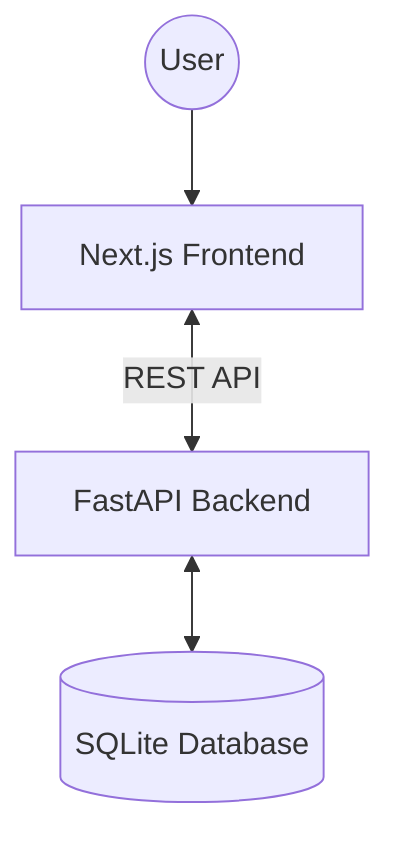

# Project: InteriorAI

InteriorAI is an end-to-end interior design and modular execution platform. It matches users with budget-friendly design packages (starting from ₹3L), lets them customize materials and fabric options, visualizes their configurations using AI rendering, and provides instant quotations and site delivery in a week.

## System Architecture

The project consists of a Next.js single-page application frontend and a FastAPI backend using SQLAlchemy and a SQLite database.



### Main Directories
* [`/frontend`](file:///d:/MyFiles/Interior_Design/frontend): Next.js application built with TypeScript, React, and Tailwind CSS.
* [`/backend`](file:///d:/MyFiles/Interior_Design/backend): Python REST API built with FastAPI, SQLAlchemy, and SQLite.
* [`/backend/pdfs/catalog`](file:///d:/MyFiles/Interior_Design/backend/pdfs/catalog): Contains all the visual product assets, thumbnails, and laminate textures used in design options.

---

## Core Workflows

### 1. Customer Onboarding & Design Flow
1. **Onboarding Questions**:
   * **Project Type**: New Home vs. Upgrade (renovation).
   * **Design Vibe**: Selection of visual style cards (Modern, Scandinavian, etc.).
   * **Material & Fabric**: Selection of wood laminate finish (Oak, Teak, Walnut) and fabric (Linen, Velvet, Woven, Leatherette).
   * **Colors**: Color Explorer selection.
   * **BHK & Property**: Address details and house configuration.
   * **Budget & Timeline**: Tier selection (Basic/Premium/Luxury), timeline and quality preference.
2. **Layout Blueprint**:
   * Choose standard layout or upload blueprint.
3. **Package Selection**:
   * Select pricing package (Basic, Premium, Luxury) filtered by BHK and budget.
4. **Room Customization**:
   * Customize individual products in each room. Live price tracking displays Base Price, Current Project Cost, and Variation in real-time.
5. **AI Renders**:
   * Generate photo-realistic images of customized rooms.
6. **Quotation Generation**:
   * Generate and download professional PDF quotes.

---

## Technical Mappings

### Database & Seed Data
* Database Path: [`backend/interior_ai.db`](file:///d:/MyFiles/Interior_Design/backend/interior_ai.db)
* Product & package thumbnails are hosted by the FastAPI static file server under `/static/pdfs/catalog/`.
* Seed script: [`backend/app/seed_data.py`](file:///d:/MyFiles/Interior_Design/backend/app/seed_data.py) and [`backend/app/seed_catalog_images.py`](file:///d:/MyFiles/Interior_Design/backend/app/seed_catalog_images.py).

---

## DOX Child Indices

For sub-system guidelines, refer to:
* **Frontend Guide**: [`frontend/AGENTS.md`](file:///d:/MyFiles/Interior_Design/frontend/AGENTS.md)
* **Backend Guide**: [`backend/AGENTS.md`](file:///d:/MyFiles/Interior_Design/backend/AGENTS.md)

---

## Development Operations

### Click-to-Run Script
Run the click-to-run script from the root folder:
```powershell
.\Click_Run.bat
```
This script validates Python/Node environments, installs dependencies, handles port clearances, and boots up both backend and frontend dev servers.
