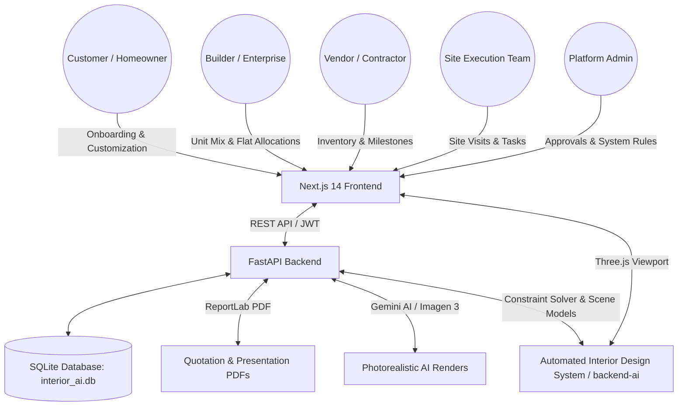

# Project: InteriorAI

**InteriorAI** is an end-to-end AI-powered interior design and modular execution platform. It unifies 5 distinct stakeholder portals into a single web platform: Homeowners (B2C), Real-Estate Builders (B2B2C Enterprise), Furniture & Decor Vendors (B2B), Site Operations & Execution Teams, and Platform Administrators.

---

## System Architecture

The application is built as a Next.js single-page application frontend and a FastAPI backend using SQLAlchemy and a SQLite database, paired with an Automated Interior Design System (backend-ai) for constraint solving and 3D scene assembly.


```mermaid
graph TD
  Customer((Customer / Homeowner)) -->|Onboarding & Customization| FE[Next.js 14 Frontend]
  Enterprise((Builder / Enterprise)) -->|Unit Mix & Flat Allocations| FE
  Vendor((Vendor / Contractor)) -->|Inventory & Milestones| FE
  Team((Site Execution Team)) -->|Site Visits & Tasks| FE
  Admin((Platform Admin)) -->|Approvals & System Rules| FE

  FE <-->|REST API / JWT| BE[FastAPI Backend]
  FE <-->|Three.js Viewport| IDS[Automated Interior Design System / backend-ai]
  BE <--> DB[(SQLite Database: interior_ai.db)]
  BE <-->|ReportLab PDF| PDF[Quotation & Presentation PDFs]
  BE <-->|Gemini AI / Imagen 3| AI[Photorealistic AI Renders]
  BE <-->|Constraint Solver & Scene Models| IDS
```

### Main Directories
* [`/frontend`](file:///d:/MyFiles/Interior_Design/frontend): Next.js 14 application built with TypeScript, React 18, Zustand, and Tailwind CSS.
* [`/backend`](file:///d:/MyFiles/Interior_Design/backend): Python REST API built with FastAPI, SQLAlchemy, SQLite, and inventory/business rules services.
* [`/backend-ai`](file:///d:/MyFiles/Interior_Design/backend-ai): Automated Interior Design System (IDS) engine with 3 workflows (CP-SAT/annealing layout solver, FP-Growth & GBR pricing, procedural PBR bakery, single-file HTML viewer assembly).
* [`/backend/assets/catalog`](file:///d:/MyFiles/Interior_Design/backend/assets/catalog): Visual product assets, thumbnails, laminate textures, and multi-view catalog images.
* [`/backend/assets/floor_plans`](file:///d:/MyFiles/Interior_Design/backend/assets/floor_plans): Uploaded customer floor plan layout blueprints.

---

## Core Workflows Across 5 Stakeholder Portals

### 1. Customer (B2C) Onboarding & Design Flow
1. **6-Step Onboarding**:
   * **Project Type**: New Home vs. Upgrade (renovation).
   * **Scope & BHK**: Select house configuration (1 BHK to 5 BHK).
   * **Budget & Timeline**: Select total budget limit and completion timeline.
   * **Design Vibe**: Single-selection style cards (Modern, Scandinavian, Indian Contemporary, Luxury, Mediterranean, Boho).
   * **Material & Fabric**: Select wood laminate finish (Oak, Teak, Walnut) and fabric preference (Linen, Velvet, Woven, Leatherette).
   * **Colors Explorer**: Interactive color family selection.
2. **Dynamic Package Selection**:
   * Packages filter dynamically by BHK and budget limit (`Basic` = budget, `Premium` = budget + ₹2L, `Luxury` = budget + ₹5L).
3. **Room Customization**:
   * Customize individual products room-by-room.
   * Live price tracking displays Base Price, Current Cost, and Variation in dual centered sub-boxes (*Remaining Budget* and *Variation Spent*).
   * Mandatory product completeness checklist per room; Balcony rooms automatically bypass completeness checks.
   * Switch to next room tab automatically upon selecting last category item.
   * Configuration Complete panel swaps product grid once all rooms are customized.
4. **4-Wall AI Renders**:
   * Visualizer studio displaying Wall A, B, C, and D perspectives.
   * Supports blueprint templates, custom photo uploads, and room dimension inputs.
   * Generates photorealistic AI images via Gemini / Imagen 3 / SDXL simulation.
5. **Quotation & Verification**:
   * Generates professional bank-compliant PDF quotes. Automatically regenerates quotes if customer revises items after review.
6. **Unified Customer Progress Cockpit & Snags**:
   * Dedicated tracking hub (`/track/[projectId]`) consolidating tracking history into an integrated view.
   * Dynamic hero circular progress gauge (0–100%) and 6 milestone stages with **strictly zero dates or day forecasts**.
   * 7-stage item filter chips (All, Ordered, Production, Ready, Dispatched, Delivered, Installed).
   * In-page item cards with dual-track progress bars: Sourcing Status (PO Approved $\rightarrow$ Dispatched $\rightarrow$ Delivered) and Site Installation Status (Site Received $\rightarrow$ Quality Checked $\rightarrow$ Customer Verified).
   * Proof photo gallery with interactive full-screen lightbox modal.
   * Multi-photo customer snag reporting flow (`POST /api/v1/customer/projects/{id}/snags`).

### 2. Enterprise / Builder (B2B2C) Flow
1. **Multi-Typology Setup Wizard**: Step 1 wizard configuration supporting multiple typology definitions (Typology A, B, C...) with custom names, BHK configurations, unit square footage, and floor plan blueprint uploads.
2. **Typology Shelf & Flat Allocation**: Dedicated Project Typologies shelf on the units dashboard and an interactive multi-column BHK allocation modal allowing developers to assign flats to typologies with a single click.
3. **Flat Allocation & Invitation**: Generate unique invitation tokens and assign customer details (name, email, phone) to specific flat units.
4. **Buyer Journey Handoff & Typology Inheritance**: Customers accept invitation tokens via `/invite`, automatically creating a child project linked to their assigned flat and pre-populated with the flat's assigned typology BHK and floor plan.
5. **B2B Tiered Bulk Volume Discounts & Portfolio Analytics**: Automated bulk pricing engine applying discounts (5% for 5–9 units, 10% for 10–19 units, 15% for 20+ units). Portfolio summary cards and unit customization breakdown tables calculate net project contract value (`Net = Base Units + Customization Upgrades - Volume Discount`).

### 3. Vendor (B2B) Portal Flow
1. **Onboarding & Document Verification**: Register business profile, submit GST/PAN numbers, and upload verification documents.
2. **Multi-View Catalog & Inventory Ledger**: Manage product inventory and upload up to 3 perspective images (Front, Side, Perspective). Real-time inventory ledger tracking physical stock, reserved stock, and available stock (`available_stock = physical_stock - reserved_stock`).
3. **Real-Time Inventory Locking & Suppression**: Automatically reserves product inventory upon quotation creation, releases held stock on quotation rejection/expiry, and permanently commits stock upon payment. Out-of-stock items (zero available) are automatically suppressed from customer customizer room views.
4. **Assignment Fulfillment**: Receive assigned project items, update 6-stage milestone progress (PO Approved $\rightarrow$ Production $\rightarrow$ Ready $\rightarrow$ Dispatched), upload proof photos, and enter shipping logistics details.
5. **Issues & Milestone Payouts**: Review customer-reported product issues (`/vendor/issues`) and track milestone-based vendor payout releases.

### 4. Project Team / Site Execution Flow
1. **Welcome Portal & Role Router**: Access workspace at `/team` to select role (`team_manager`, `team_coordinator`, `team_technician`).
2. **Dedicated Role Dashboards**:
   * **Manager Console (`/team/manager`)**: Portfolio metrics, team utilization rates, SLA performance analytics, resource assignment controls.
   * **Coordinator Console (`/team/coordinator`)**: Assigned projects, sourcing status tracking, vendor delay alerts, site visit scheduling, daily checklist forms.
   * **Technician Field Console (`/team/technician`)**: Assigned installation items, daily checklists, direct proof photo uploads with multipart form support.
3. **Execution Workspaces & Timeline**: Project workspace at `/projects/[projectId]/execution` with item tracking, tasks, site visit logs, document vault, and customer call logs.

### 5. Admin Portal Flow
1. **Admin Control Hub & Layout**: Main dashboard at `/admin` with unified sidebar navigation across 11 specialized sub-routes.
2. **Modular Admin Sub-Pages**:
   * **Client CRM (`/admin/customers`)**: Directory of customers, profile editing, account suspension, and reactivation. Auto-synced with enterprise project deletions to prevent ghost accounts.
   * **Enterprise Partner Management (`/admin/enterprise`)**: Dedicated management page for B2B real-estate builder accounts, parent property setups, unit allocations, and developer portfolios.
   * **Vendor Governance (`/admin/vendors`)**: Onboarding application review, document inspection, approval, rejection, and vendor suspension.
   * **Team Onboarding & Approvals (`/admin/project-team`)**: Pending team registration approvals and role matrix assignment controls (`AdminRole`).
   * **Project Control Center (`/admin/projects`)**: Master project creation, team & vendor resource assignments, closing, and cancellation.
   * **Master Data Management (`/admin/master-data`)**: Product catalog CRUD, CSV bulk import, and CSV export.
   * **Reports & Operational CSV Exports (`/admin/reports`)**: Live CSV report generation for sales, revenue, projects, vendors, and customers.
   * **AI Engine Customization (`/admin/ai-engine`)**: AI model selection, rendering parameters, and prompt tuning templates.
   * **IT Box & System Settings (`/admin/settings`)**: Dynamic platform key-value settings management (`SystemSetting`).
   * **Audit Trail & System Logs (`/admin/audit-log` & `/admin/activity-log`)**: Full administrative action logs (`AuditLog`) and real-time developer activity stream.

---

## Dynamic Platform Constraints (Phase 9 & 10)

### 1. Dynamic Package Pricing
* **Basic**: `budget`
* **Premium**: `budget + ₹2,00,000` (₹2L)
* **Luxury**: `budget + ₹5,00,000` (₹5L)

### 2. Custom BHK Mappings
* **1 BHK**: Living Room, Bedroom Master (labeled "Bedroom"), Kitchen, Bathroom, Balcony
* **2 BHK to 5 BHK**: Living Room, Bedroom Master, Bedroom 2–5, Kitchen, Bathroom, Bathroom 2–4, Balcony

### 3. Budget Recommendation Constraints
* **₹3L – ₹5L Budget**: Max product price cap = **₹75,000**
* **₹5L – ₹8L Budget**: Max product price cap = **₹1,25,000**
* **₹8L – ₹12L Budget**: Max product price cap = **₹2,00,000**
* **₹12L – ₹20L Budget**: Max product price cap = **₹3,50,000**
* **₹20L+ Budget**: Max product price cap = **₹5,00,000**

### 4. Enterprise Bulk Volume Discount Tiers
* **5–9 Units**: 5% discount on base package and upgrade totals
* **10–19 Units**: 10% discount on base package and upgrade totals
* **20+ Units**: 15% discount on base package and upgrade totals
* **Net Formula**: `Net Contract Value = Base Units + Customization Upgrades - Volume Discount`

### 5. Customizer & Navigation Rules
* **Single-Select Design Vibe**: Selecting a new style card in onboarding replaces the previous selection.
* **Onboarding Draft Auto-Save & Step Tracking**: B2C onboarding creates a draft project at Step 1 and updates preferences on every step transition (`projectsAPI.update`). Clicking *Continue Onboarding* on `/dashboard` resumes at the exact incomplete step without creating duplicate projects.
* **Enterprise Locked Onboarding Steps & Typology Inheritance**: For Enterprise Child Projects (`parent_project_id != null`), Steps 0–2 (Property Details, BHK, Budget, Timeline) are strictly locked. Homebuyers resume directly at Step 3 (Design Vibe) inheriting the flat's assigned typology BHK and blueprint layout.
* **Preference Legend & Indicator Dots UI**: Customizer section header features a Preference Legend Card. Product cards display compact indicator dots for preference mismatches: 🟡 Material/Fabric, 🔵 Color, and 🔴 Budget Cap limit.
* **Real-Time Stock Badges & Out-of-Stock Suppression**: Catalog products display live availability badges ("In Stock (X left)", "Low Stock", "Out of Stock"). Items with zero available stock (`available_stock <= 0`) are suppressed from room customizer selection grids.
* **Real-Time Inventory Reservation Lifecycle**: Creating a quotation reserves item stock atomically via `inventory_service.py`. Quote expiration or cancellation auto-releases stock. Making quotation payment commits stock permanently.
* **Customer Progress Zero-Date Policy**: Progress tracking across all 6 milestone stages displays pure completion percentages (0–100%) with strictly no estimated completion dates or remaining days shown.
* **Approval Queue & Supplier Allocation (stakeholder feedback 4.2–4.5)**: There is no straight-through flow. Every new project enters the admin approval queue (`Project.approval_status = PENDING`, `/admin/approvals`). `sync_project_vendor_assignments(project.id, db)` is a no-op until the project is `APPROVED` **and** has an `allocated_vendor_id`; it then assigns items only to that supplier. Customer quotation approval, quotation generation and the vendor dashboard all go through this gate.
* **Vendor Portal Auto-Approval**: Accessing the Vendor Portal (`/vendor/dashboard`) still marks the seeded vendor `APPROVED` and `active = True`, but orders only appear once an admin allocates a project to that vendor.
* **BHK Format**: The canonical form is `3BHK` (packages, room templates, onboarding). Use `normalize_bhk()` from `services/business_rules.py` for any lookup — the IDS 3D engine and some callers send `3 BHK`.
* **Converted Projects**: A project created from a paid quotation is linked via `defaults.converted_from_project_id`, never `parent_project_id` (which marks an enterprise flat and locks onboarding steps).
* **Balcony Auto-Complete**: `checkRoomCompleteness` automatically returns `true` for balcony rooms.
* **Auto Tab Progression**: Completing product selection for the last category in a room automatically switches to the next room tab.
* **Configuration Complete Panel**: When all rooms are complete, the product selection area swaps to a green-accented prompt to proceed to AI Render.

---

## Technical Mappings & Seed Data

* **Database Path**: [`backend/interior_ai.db`](file:///d:/MyFiles/Interior_Design/backend/interior_ai.db)
* **Static Assets Server**: FastAPI mounts `/static/assets` serving generated PDF quotes, floor plans, and catalog images at `http://localhost:8000/static/assets/catalog/`.
* **Seed Scripts**: [`backend/app/seed_data.py`](file:///d:/MyFiles/Interior_Design/backend/app/seed_data.py) and [`backend/app/seed_catalog_images.py`](file:///d:/MyFiles/Interior_Design/backend/app/seed_catalog_images.py).

---

## DOX Child Indices

For system architecture and sub-system guides, refer to:
* **System Architecture Specification**: [`ARCHITECTURE.md`](file:///d:/MyFiles/Interior_Design/ARCHITECTURE.md)
* **Frontend Guide**: [`frontend/AGENTS.md`](file:///d:/MyFiles/Interior_Design/frontend/AGENTS.md)
* **Backend Guide**: [`backend/AGENTS.md`](file:///d:/MyFiles/Interior_Design/backend/AGENTS.md)
* **AI Engine & 3D Solver Guide**: [`backend-ai/AGENTS.md`](file:///d:/MyFiles/Interior_Design/backend-ai/AGENTS.md)

---

## Development Operations

### Click-to-Run Script (Windows)
Run the batch launcher script from the root folder:
```powershell
.\Click_Run.bat
```
This script validates Python/Node environments, initializes `.venv`, installs dependencies, seeds default packages and catalogs, handles port clearances, and boots both FastAPI (`http://localhost:8000`) and Next.js (`http://localhost:3000`) dev servers.
