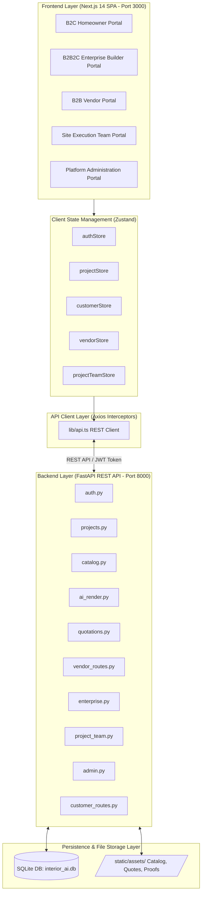
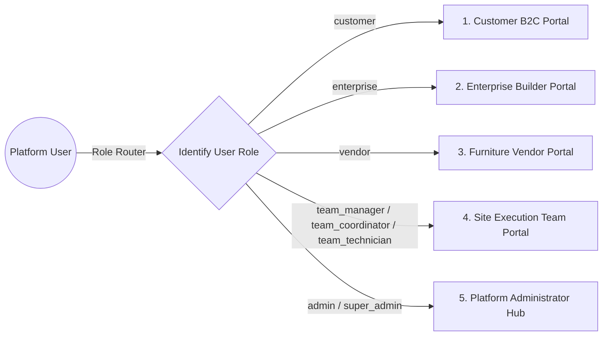
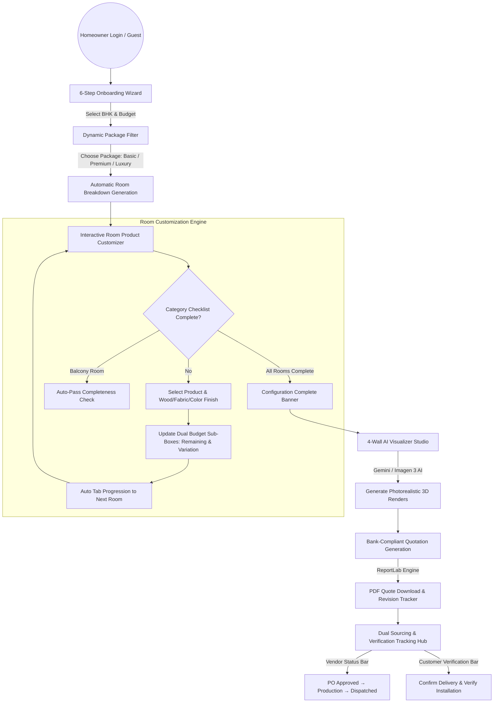
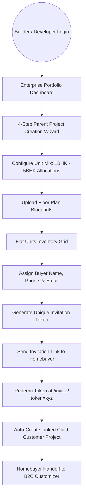
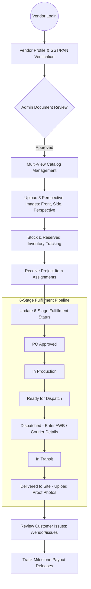
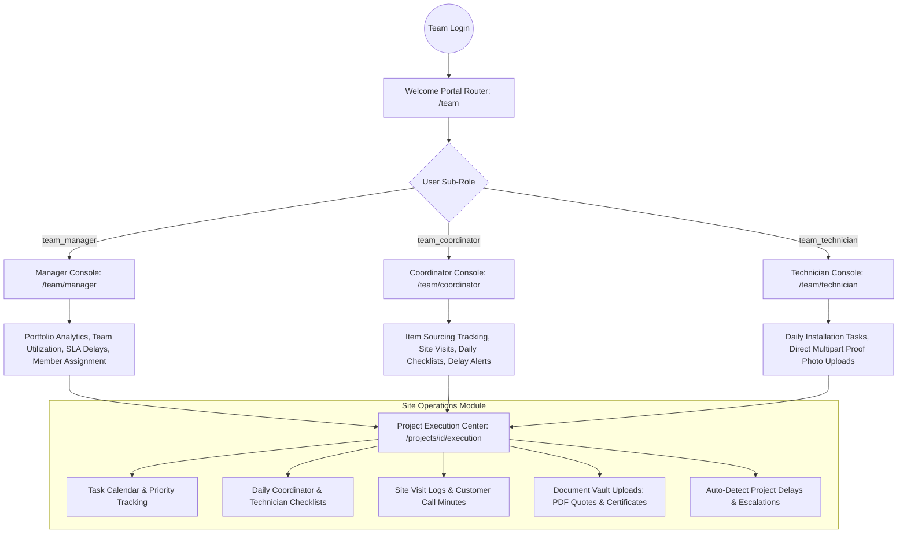
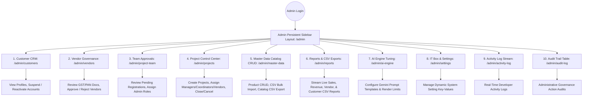
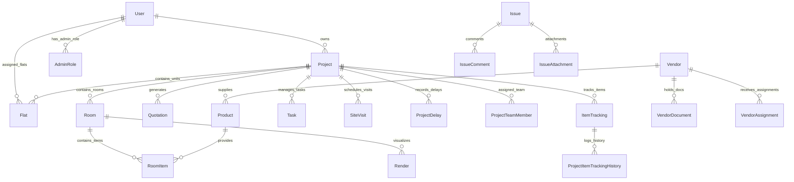

# 🏗️ InteriorAI — Comprehensive System Architecture & Stakeholder Flow Specification

> **End-to-End AI-Powered Interior Design & Modular Execution Platform**

This document serves as the authoritative architectural blueprint for **InteriorAI**, specifying the system layout, data flows, API boundaries, database schemas, and stakeholder interaction paths across all 5 unified platform portals.

---

## 📌 1. High-Level System Architecture

InteriorAI is built using a modern decoupled web architecture consisting of a **Next.js 14 (App Router)** single-page frontend application and a high-performance **FastAPI (Python 3.10+)** RESTful backend engine powered by **SQLAlchemy ORM** and an embedded **SQLite database** (`interior_ai.db`).



---

## 🔄 2. Stakeholder Workflows & Branching Flows

InteriorAI unifies 5 distinct stakeholder personas into a single web application. Each stakeholder operates through specialized workflows, security boundaries, and API routes.



---

### 2.1 Customer (B2C Homeowner) Flow

The Homeowner journey guides users from initial property details to AI 3D visualization, quotation approval, and real-time installation tracking.



**Key Customer Routes & APIs:**
* Onboarding: `/onboarding` $\rightarrow$ `POST /api/v1/projects`
* Packages: `/packages` $\rightarrow$ `GET /api/v1/recommendations/packages`
* Customizer: `/customize/[projectId]` $\rightarrow$ `PUT /api/v1/projects/{id}/rooms/{roomId}`
* AI Studio: `/visualize/[projectId]` $\rightarrow$ `POST /api/v1/ai/render`
* Quotation: `/quotation/[projectId]` $\rightarrow$ `POST /api/v1/quotations/{id}/generate`
* Verification: `/track/[projectId]/execution` $\rightarrow$ `PUT /api/v1/customer/projects/{id}/tracking/{trackingId}`

---

### 2.2 Enterprise / Builder (B2B2C) Flow

Real-estate developers setup parent properties, configure multi-unit flat mixes, assign buyers, and issue invitations.



**Key Enterprise Routes & APIs:**
* Dashboard: `/enterprise/dashboard` $\rightarrow$ `GET /api/v1/enterprise/projects`
* Creation Wizard: `/enterprise/create-project` $\rightarrow$ `POST /api/v1/enterprise/projects`
* Flat Inventory: `/enterprise/project/[id]` $\rightarrow$ `GET /api/v1/enterprise/projects/{id}/flats`
* Invitations: `/invite` $\rightarrow$ `POST /api/v1/enterprise/invitations/accept`

---

### 2.3 Furniture & Decor Vendor (B2B) Flow

Vendors manage product catalogs, inventory levels, order assignments, logistics tracking, and customer issues.



**Key Vendor Routes & APIs:**
* Onboarding: `/vendor/onboarding` $\rightarrow$ `POST /api/v1/vendor/onboarding`
* Products Catalog: `/vendor/products` $\rightarrow$ `POST /api/v1/vendor/products/{id}/image?view_index=0`
* Assignments: `/vendor/assignments` $\rightarrow$ `PATCH /api/v1/vendor/assignments/{id}`
* Logistics: `/vendor/assignments` $\rightarrow$ `PUT /api/v1/vendor/assignments/{id}/shipment`
* Issues Tracker: `/vendor/issues` $\rightarrow$ `GET /api/v1/vendor/issues`

---

### 2.4 Project Team / Site Execution Flow

The execution team operates through a role-based router directing Site Managers, Coordinators, and Field Technicians to specialized consoles.



**Key Team Routes & APIs:**
* Welcome Router: `/team` $\rightarrow$ `GET /api/v1/team/team/directory`
* Manager Console: `/team/manager` $\rightarrow$ `GET /api/v1/team/team/dashboard`
* Coordinator Console: `/team/coordinator` $\rightarrow$ `GET /api/v1/team/team/projects`
* Field Technician Console: `/team/technician` $\rightarrow$ `POST /api/v1/team/projects/{id}/photos`
* Execution Center: `/projects/[id]/execution` $\rightarrow$ `GET /api/v1/team/projects/{id}/tracking`

---

### 2.5 Platform Administrator Flow

Super Admins and Operations Managers manage the platform via a persistent navigation layout across 10 specialized sub-routes.



**Key Admin Routes & APIs:**
* Customer CRM: `/admin/customers` $\rightarrow$ `GET /api/v1/admin/customers`
* Vendor Approvals: `/admin/vendors` $\rightarrow$ `POST /api/v1/admin/vendors/{id}/approve`
* Team Approvals: `/admin/project-team` $\rightarrow$ `GET /api/v1/admin/team-approvals`
* Master Data & CSV: `/admin/master-data` $\rightarrow$ `POST /api/v1/admin/master/import`
* Operational Reports: `/admin/reports` $\rightarrow$ `GET /api/v1/admin/reports?category=sales`

---

## 🗄️ 3. Database Entity Relationship Model (`models.py`)

The SQLite database (`interior_ai.db`) enforces declarative relational mappings via SQLAlchemy.



---

## ⚙️ 4. Dynamic Platform Rules & Constraints

### 1. Dynamic Package Pricing Engine
* **Basic Package**: `budget`
* **Premium Package**: `budget + ₹2,00,000` (₹2L)
* **Luxury Package**: `budget + ₹5,00,000` (₹5L)

### 2. Custom BHK Mappings
* **1 BHK**: Living Room, Bedroom Master (labeled "Bedroom"), Kitchen, Bathroom, Balcony
* **2 BHK to 5 BHK**: Living Room, Bedroom Master, Bedroom 2–5, Kitchen, Bathroom, Bathroom 2–4, Balcony

### 3. Budget Recommendation Caps
* **₹3L – ₹5L Budget**: Max product price cap = **₹75,000**
* **₹5L – ₹8L Budget**: Max product price cap = **₹1,25,000**
* **₹8L – ₹12L Budget**: Max product price cap = **₹2,00,000**
* **₹12L – ₹20L Budget**: Max product price cap = **₹3,50,000**
* **₹20L+ Budget**: Max product price cap = **₹5,00,000**

---

## 🚀 5. Development & Deployment Operational Commands

### Click-to-Run Launcher (Windows)
Run the root batch launcher to validate environments, initialize `.venv`, seed test databases, handle port clearances, and start both servers:
```powershell
.\Click_Run.bat
```

* **Frontend Web App**: `http://localhost:3000`
* **FastAPI Backend API**: `http://localhost:8000`
* **Swagger API Documentation**: `http://localhost:8000/docs`
