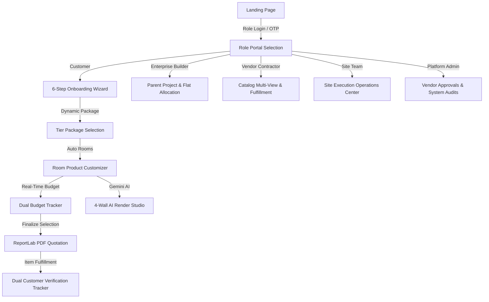

# 🏠 InteriorAI Platform

> **AI-Based Modular Interior Design & Execution Platform**

InteriorAI is an end-to-end web application that simplifies the interior design and execution journey for homeowners, real estate developers, contractors, site execution teams, and administrators. By combining interactive 3D/4-Wall rendering, AI photorealistic visualizations, real-time dynamic pricing updates, bank-compliant PDF quote generation, and contractor logistics tracking, the platform takes you from a blank BHK layout to a professional quotation and ready-to-execute design in under 10 minutes.

---

## 🌟 Key Features Across 5 Stakeholder Portals

### 1. Customer (Homeowner B2C) Portal
* **6-Step Interactive Onboarding Wizard**: Guided flow capturing project type (New Home vs. Renovation), BHK scope (1BHK to 5BHK), budget limit, completion timeline, single-select design vibe (Modern, Scandinavian, Indian Contemporary, Luxury, Mediterranean, Boho), wood laminate finish (Oak, Teak, Walnut), fabric preference (Linen, Velvet, Woven, Leatherette), and color explorer.
* **Dynamic Package Pricing**: Packages automatically compute tier prices based on onboarding budget limit (`Basic` = budget, `Premium` = budget + ₹2L, `Luxury` = budget + ₹5L).
* **Interactive 3D Room Canvas & 4-Wall AI Studio**: Powered by Three.js, `@react-three/fiber`, and Gemini / Imagen 3 AI. View Wall A, B, C, D perspectives, test blueprint templates, upload photo layouts, and input room dimensions with automatic pillar clearance.
* **Smart Customizer & Dual Budget Tracking**: Customize room items with live cost updates. The budget tracker bar splits into two centered sub-boxes (*Remaining Budget* and *Variation Spent*). Features auto tab progression (switches to next room tab after last category selection), balcony auto-complete override, and an all-complete redirect panel.
* **ReportLab PDF Quotation Generator**: Generates professional, bank-compliant PDF quotes with detailed room line items, GST breakdown, terms, and bank details. Automatically regenerates quotes if revised after customer review.
* **Dual Customer Tracking System**: Read-only **Vendor Status Bar** visualizes item sourcing progress (Ordered to Dispatched) in real time; interactive **Customer Verification Bar** permits homeowners to confirm deliveries and installations.

### 2. Enterprise / Builder (B2B2C) Portal
* **4-Step Parent Project Creation Wizard**: Configure multi-unit parent projects with unit mix distributions (1BHK to 5BHK) and default design package assignments.
* **Flat Allocation & Token Invitations**: Assign customer details (Name, Email, Phone) to specific flat units and generate secure invitation tokens (`/invite`).
* **Portfolio Dashboard**: High-level portfolio completion metrics, flat allocation grids, and recent project activity timestamps.

### 3. Vendor (B2B) Portal
* **Vendor Onboarding & Document Verification**: Submit business details, GST/PAN numbers, and upload verification certificates for admin approval.
* **Multi-View Catalog Management**: Manage catalog products and upload up to 3 perspective images (Front, Side, Perspective) mapped to thumbnail slots.
* **Order Fulfillment & Logistics Tracking**: Accept/reject item assignments, update 6-stage milestone progress (PO Approved $\rightarrow$ Production $\rightarrow$ Ready $\rightarrow$ Dispatched), upload verification proof photos, and enter courier/vehicle tracking details.
* **Issues Tracking & Milestone Payouts**: Review customer-reported product issues (`/vendor/issues`) and track milestone-based payout releases.

### 4. Project Team / Site Execution Center
* **Welcome Portal & Role Router**: Role selection hub (`/team`) routing users to dedicated manager, coordinator, or technician consoles.
* **Role-Specific Execution Dashboards**:
  * **Manager Console (`/team/manager`)**: Portfolio metrics, active vs. delayed projects, team utilization rate, SLA performance metrics, resource assignments.
  * **Coordinator Console (`/team/coordinator`)**: Assigned projects, item sourcing tracking, vendor delay alerts, site visit scheduling, daily checklist forms.
  * **Technician Field Console (`/team/technician`)**: Today's installation tasks, daily checklists, direct proof photo uploads with multipart form support.
* **Operations Console**: Project execution workspace (`/projects/[projectId]/execution`) featuring item tracking, task calendars, checklists, site visit logs, document vault, and SLA delay reporting.

### 5. Admin Control Center
* **Unified Admin Portal Layout**: Super Admin console at `/admin` with persistent sidebar navigation across 10 specialized sub-routes.
* **10 Dedicated Admin Sub-Pages**:
  * **Client CRM (`/admin/customers`)**: Customer directory, profile management, account suspension, and reactivation.
  * **Vendor Governance (`/admin/vendors`)**: Onboarding application review, document inspection, approval, rejection, and suspension.
  * **Team Approvals (`/admin/project-team`)**: Pending team registration approvals and role matrix permissions assignment (`AdminRole`).
  * **Project Control Center (`/admin/projects`)**: Project creation, manager/coordinator/technician/vendor resource assignment, project closing, and cancellation.
  * **Master Data Management (`/admin/master-data`)**: Master product catalog CRUD, CSV bulk import, and CSV export.
  * **Operational Reports (`/admin/reports`)**: Live CSV report generation for sales, revenue, projects, vendors, and customers.
  * **AI Engine Tuning (`/admin/ai-engine`)**: AI model selection, rendering parameters, and prompt customization templates.
  * **IT Box & System Settings (`/admin/settings`)**: Dynamic platform key-value settings management (`SystemSetting`).
  * **Audit Logs (`/admin/audit-log` & `/admin/activity-log`)**: Full administrative action trail (`AuditLog`) and real-time developer activity stream.

---

## 🛠️ Tech Stack

### Frontend (Next-Gen Web Interface)
* **Framework:** Next.js 14 (App Router) & React 18
* **Language:** TypeScript
* **Styling:** TailwindCSS & Framer Motion (micro-animations, swipe-to-delete notifications)
* **3D Graphics:** Three.js, `@react-three/fiber`, `@react-three/drei`
* **State Management:** Zustand (`authStore`, `projectStore`, `customerStore`, `vendorStore`, `projectTeamStore`)
* **Data Fetching:** SWR & Axios

### Backend (Robust RESTful API)
* **Framework:** FastAPI (Python 3.10+)
* **Server:** Uvicorn (ASGI)
* **Database ORM:** SQLAlchemy (SQLite database: `interior_ai.db`)
* **Data Validation:** Pydantic v2
* **Authentication:** JWT (JSON Web Tokens) via `python-jose` & `passlib` (Bcrypt)
* **PDF Generation:** ReportLab PDF library
* **AI Image Generation:** Google Gemini API / Imagen 3 / ControlNet rendering simulation
* **Image Processing:** Pillow

---

## 📁 Project Directory Structure

```text
Interior_Design/
├── Click_Run.bat           # Automated launcher (Backend + Frontend + DB Seeding)
├── AGENTS.md               # Root AI agent memory index & system rules
├── ARCHITECTURE.md         # Full System Architecture & Stakeholder Flow Diagrams
├── .gitignore              # Cleaned & deduplicated exclusion configuration
├── backend/
│   ├── AGENTS.md           # Backend architecture & router guide
│   ├── .env                # Server configuration & JWT secrets
│   ├── requirements.txt    # Python package dependencies
│   ├── interior_ai.db      # SQLite database instance
│   ├── pdfs/               # Generated quotation PDFs & uploaded floor plans
│   └── app/
│       ├── main.py         # FastAPI application entry point & router mounting
│       ├── db.py           # Database engine, session setup, and demo seeder
│       ├── models.py       # SQLAlchemy database schemas (User, Project, Room, Product, etc.)
│       ├── schemas.py      # Pydantic schemas for request/response validation
│       ├── auth_utils.py   # JWT token issuance and auth dependencies
│       ├── seed_data.py    # Seed scripts for products, packages, and vendors
│       ├── routers/        # 14 Modular API routers (auth, projects, catalog, vendors, team, etc.)
│       └── services/       # Core service modules (pdf_service.py, render_mock.py)
└── frontend/
    ├── AGENTS.md           # Frontend architecture & page routes guide
    ├── package.json        # NPM dependencies and scripts
    ├── next.config.js      # Next.js build options
    ├── tsconfig.json       # TypeScript configuration
    └── src/
        ├── app/            # Next.js App Router pages (30 routes across 5 portals)
        ├── components/     # Reusable UI widgets, CategoryDropdown, RoomCanvas3D
        ├── lib/            # Axios API client and color utilities
        └── stores/         # Zustand global state stores (5 stores)
```

---

## 🚀 Quick Start (Windows)

The repository includes an automated batch script that checks environment requirements, installs dependencies, seeds default data, and starts up both development servers.

1. Double-click **`Click_Run.bat`** at the root of the project folder.
2. The script will:
   * Validate **Python 3.10+** and **Node.js 18+**.
   * Create and activate a Python virtual environment (`.venv`) in `backend/` and install `requirements.txt`.
   * Run `npm install` in `frontend/`.
   * Initialize and seed the SQLite database with design packages, catalog products, and reviewer demo accounts.
   * Start the FastAPI backend server (`http://localhost:8000`) and Next.js frontend dev server (`http://localhost:3000`).
   * Automatically launch the web application in your browser at `http://localhost:3000`.

---

## 💻 Manual Setup (All Operating Systems)

To run the application components manually, open two terminal windows:

### 1. Backend Setup
```bash
cd backend
python -m venv .venv
source .venv/bin/activate       # On Windows: .venv\Scripts\activate
pip install -r requirements.txt
python -m uvicorn app.main:app --host 0.0.0.0 --port 8000 --reload
```
* **API Documentation**: Interactive Swagger UI is available at `http://localhost:8000/docs`.

### 2. Frontend Setup
```bash
cd frontend
npm install
npm run dev
```
* **Client Portal**: Access the web interface at `http://localhost:3000`.

---

## 🔄 System Architecture & Data Flow



---

## 🛡️ Security & Environment Configuration

Environment settings are managed via the `.env` file in `backend/`. Update default keys before deploying to production:

```env
DATABASE_URL=sqlite:///./interior_ai.db
JWT_SECRET=your_secure_production_jwt_secret_key_here
JWT_ALGORITHM=HS256
ACCESS_TOKEN_EXPIRE_MINUTES=60
PDF_OUTPUT_DIR=./pdfs

# Google AI Studio API Key for AI Photorealistic Room Rendering
GEMINI_KEY=your_gemini_api_key_here
```
