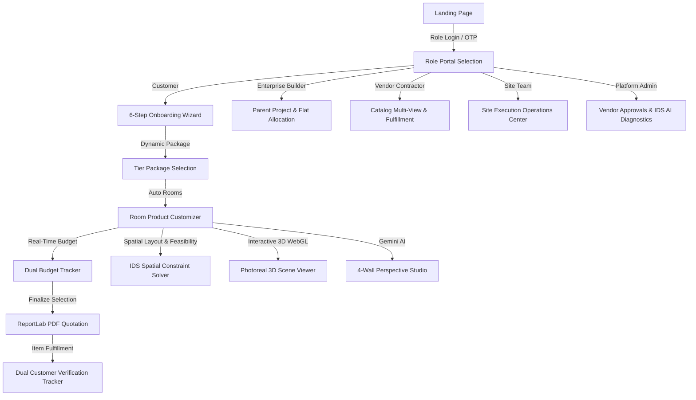

# 🏠 InteriorAI Platform

> **AI-Powered Modular Interior Design & Spatial Execution Platform**

InteriorAI is an end-to-end, multi-stakeholder web platform that transforms interior design and execution. It seamlessly bridges homeowners, real estate developers, furniture and decor vendors, site execution teams, and administrators. 

By unifying **interactive 3D spatial solving**, **associative AI recommendations**, **4-wall photorealistic rendering**, **real-time dynamic package pricing**, **bank-compliant PDF quotation generation**, and **field execution logistics**, InteriorAI takes stakeholders from a raw floor plan to an optimized 3D layout, verified quote, and factory-to-site fulfillment in minutes.

---

## 🌟 Key Features Across 5 Stakeholder Portals

### 1. Customer (Homeowner B2C) Portal
* **6-Step Interactive Onboarding Wizard**: Guided flow capturing project type (New Home vs. Renovation), BHK scope (1 BHK to 5 BHK), budget limit, completion timeline, single-select design vibe, wood laminate finish, fabric preference, and color explorer. Automatically persists draft projects at Step 1 and enables seamless step continuation from `/dashboard` without duplicate records.
* **Dynamic Package Pricing**: Automatically scales tier prices based on customer budget limits (`Basic` = budget, `Premium` = budget + ₹2L, `Luxury` = budget + ₹5L).
* **Interactive 3D Room Canvas & 4-Wall AI Studio**: Powered by Three.js, `@react-three/fiber`, and Gemini / Imagen 3 AI. View Wall A, B, C, and D perspectives, test blueprint templates, upload layout blueprints, and customize dimensions with automatic pillar clearance.
* **IDS Spatial Constraint Solver & Photoreal 3D Scene**: Embedded spatial layout engine that evaluates collision-free furniture placement (0 hard-constraint violations), computes ML-driven price predictions via Gradient Boosting, and surfaces FP-Growth associative product add-ons. Includes a synchronized 2D architectural plan and interactive 3D WebGL viewer with procedural PBR texturing and fullscreen mode (`/api/v1/ai/interactive-viewer/[projectId]`).
* **Smart Customizer & Preference Indicator Legend**: Features a Preference Legend Card and compact indicator dots on product cards (🟡 Material/Fabric, 🔵 Color, 🔴 Budget Cap). Customizes room items with live price tracking, dual budget sub-boxes (*Remaining Budget* and *Variation Spent*), auto-tab progression, balcony auto-complete, and all-complete panel.
* **ReportLab PDF Quotation Generator**: Produces bank-compliant PDF quotes with itemized room specifications, GST breakdowns, terms, and banking details. Automatically regenerates quotes whenever items are revised.
* **Dual Customer Verification Tracker**: Read-only **Vendor Status Bar** visualizes item sourcing progress (Ordered to Dispatched) in real time; interactive **Customer Verification Bar** permits homeowners to confirm deliveries and installations.

### 2. Enterprise / Builder (B2B2C) Portal
* **4-Step Parent Project Creation Wizard**: Configure multi-unit developer properties with unit mix distributions (1 BHK to 5 BHK) and default design package assignments.
* **Flat Allocation & Token Invitations**: Assign customer details (Name, Email, Phone) to specific flat units and generate secure invitation tokens (`/invite`). Homeowners accept tokens to create linked child projects with locked baseline properties.
* **Portfolio Dashboard**: High-level portfolio completion metrics, flat allocation grids, and recent project activity timestamps.

### 3. Vendor (B2B) Portal
* **Vendor Onboarding & Document Verification**: Submit business details, GST/PAN numbers, and upload verification certificates for admin approval.
* **Multi-View Catalog Management**: Manage catalog items with up to 3 perspective images (Front, Side, Perspective), dynamic pincode order routing, and inventory tracking.
* **Order Fulfillment & Logistics Tracking**: Accept/reject item assignments, update 6-stage milestone progress (PO Approved $\rightarrow$ Production $\rightarrow$ Ready $\rightarrow$ Dispatched), upload proof photos, and enter shipping logistics details.
* **Issues Tracking & Milestone Payouts**: Review customer-reported product issues (`/vendor/issues`) and track milestone-based payout releases.

### 4. Project Team / Site Execution Center
* **Welcome Portal & Role Router**: Role selection hub (`/team`) routing field users to dedicated manager, coordinator, or technician consoles.
* **Role-Specific Execution Dashboards**:
  * **Manager Console (`/team/manager`)**: Portfolio metrics, active vs. delayed projects, team utilization rate, SLA performance metrics, and resource assignments.
  * **Coordinator Console (`/team/coordinator`)**: Assigned projects, item sourcing tracking, vendor delay alerts, site visit scheduling, and daily checklists.
  * **Technician Field Console (`/team/technician`)**: Today's installation tasks, daily checklists, and direct photo uploads with multipart form support.
* **Operations Console**: Project execution workspace (`/projects/[projectId]/execution`) featuring item tracking, task calendars, checklists, site visit logs, document vault, and SLA delay reporting.

### 5. Admin Control Center
* **Unified Admin Portal Layout**: Super Admin console at `/admin` with persistent sidebar navigation across 11 specialized sub-routes.
* **11 Dedicated Admin Sub-Pages**:
  * **Client CRM (`/admin/customers`)**: Customer directory, profile management, account suspension, and reactivation. Auto-synced with enterprise project deletions to prevent ghost accounts.
  * **Enterprise Partner Management (`/admin/enterprise`)**: Dedicated builder partner hub for developer accounts, parent property projects, unit mixes, and portfolio metrics.
  * **Vendor Governance (`/admin/vendors`)**: Onboarding application review, document inspection, approval, rejection, and suspension.
  * **Team Approvals (`/admin/project-team`)**: Pending team registration approvals and role matrix permissions assignment (`AdminRole`).
  * **Project Control Center (`/admin/projects`)**: Master project creation, manager/coordinator/technician/vendor resource assignment, project closing, and cancellation.
  * **Master Data Management (`/admin/master-data`)**: Master product catalog CRUD, CSV bulk import, and CSV export.
  * **Operational Reports (`/admin/reports`)**: Live CSV report generation for sales, revenue, projects, vendors, and customers.
  * **AI Engine & IDS Solver Control (`/admin/ai-engine`)**: Live monitoring of the Automated Interior Design System (IDS) pipeline, model health diagnostics (`/api/v1/ai/health`), CP-SAT/annealing spatial solver metrics, pre-trained artifact inspection (`bundle.joblib`), rendering parameters, and AI prompt tuning templates.
  * **IT Box & System Settings (`/admin/settings`)**: Dynamic platform key-value settings management (`SystemSetting`).
  * **Audit Logs (`/admin/audit-log` & `/admin/activity-log`)**: Full administrative action trail (`AuditLog`) and real-time developer activity stream.

---

## 🛠️ Tech Stack

### Frontend (Next-Gen Web Interface)
* **Framework:** Next.js 14 (App Router) & React 18
* **Language:** TypeScript
* **Styling:** TailwindCSS & Framer Motion (micro-animations, transitions)
* **3D Graphics & Canvas:** Three.js, `@react-three/fiber`, `@react-three/drei`
* **3D WebGL Bridge:** Interactive HTML5 scene viewer embedding with real-time room configuration sync
* **State Management:** Zustand (`authStore`, `projectStore`, `customerStore`, `vendorStore`, `projectTeamStore`)
* **Data Fetching:** SWR & Axios

### Backend (Robust RESTful API)
* **Framework:** FastAPI (Python 3.10+)
* **Server:** Uvicorn (ASGI)
* **Database ORM:** SQLAlchemy (SQLite database: `interior_ai.db`)
* **Data Validation:** Pydantic v2
* **Authentication:** JWT (JSON Web Tokens) via `python-jose` & `passlib` (Bcrypt)
* **PDF Generation:** ReportLab PDF library
* **Image Processing:** Pillow
* **AI Image Generation:** Google Gemini API / Imagen 3 / ControlNet rendering simulation

### AI & Spatial Optimization Engine (`backend-ai/` & `ids` package)
* **Automated Interior Design System (IDS):** Unified scene model (`ids.scene.Scene`) and hard-constraint validator.
* **Spatial Constraint Solver:** Simulated Annealing & Google OR-Tools CP-SAT feasibility backends (`ids.solver`) for collision-free furniture placement and door/window clearances.
* **Predictive Pricing Model:** Scikit-Learn Gradient Boosting Regressor (`ids.models`) trained on historical and bootstrap orders.
* **Associative Recommendation Engine:** FP-Growth association rule mining for complementary decor and furniture add-ons.
* **Style & Texture Generation:** TF-IDF content-based style embeddings and procedural PBR texture bakery (`ids.textures`).
* **Assembly & Export:** Single-file HTML WebGL 3D scene assembly (`ids.export`) with interactive OrbitControls and synchronized 2D floor plans.
* **Backend Bridge:** Native service integration (`backend/app/services/ids_service.py`) routing requests directly into the FastAPI application.

---

## 📁 Project Directory Structure

```text
Interior_Design/
├── Click_Run.bat                   # Automated launcher (Backend + Frontend + DB Seeding)
├── AGENTS.md                       # AI agent operational memory & system guidelines
├── ARCHITECTURE.md                 # Full System Architecture & Stakeholder Flow Diagrams
├── README.md                       # Master project overview & setup documentation
├── check_db.py                     # Database inspection utility script
├── fix_thumbnails.py               # Catalog thumbnail validation script
├── backend/
│   ├── AGENTS.md                   # Backend architecture & router guide
│   ├── .env                        # Server configuration & JWT secrets
│   ├── requirements.txt            # Python dependencies (FastAPI, SQLAlchemy, scikit-learn, joblib)
│   ├── interior_ai.db              # SQLite database instance
│   ├── pdfs/                       # Generated quotation PDFs & uploaded floor plans
│   ├── assets/                     # Catalog assets, floor plans, and render files
│   └── app/
│       ├── main.py                 # FastAPI application entry point & router mounting
│       ├── db.py                   # Database engine, session setup, and demo seeder
│       ├── models.py               # SQLAlchemy database schemas (User, Project, Room, Product, etc.)
│       ├── schemas.py              # Pydantic schemas for request/response validation
│       ├── auth_utils.py           # JWT token issuance and auth dependencies
│       ├── seed_data.py            # Seed scripts for products, packages, and vendors
│       ├── routers/                # 14 Modular API routers (auth, projects, catalog, ai_render, etc.)
│       └── services/               # Core services (pdf_service.py, ids_service.py, render_mock.py)
├── backend-ai/                     # Automated Interior Design System (IDS) engine
│   ├── README.md                   # IDS engine architecture & CLI documentation
│   ├── pyproject.toml              # IDS packaging & dependency specification
│   ├── ids/                        # Core IDS Python package
│   │   ├── scene.py                # Shared scene model & hard-constraint validator
│   │   ├── solver.py               # Spatial layout solver (CP-SAT feasibility & annealing)
│   │   ├── models.py               # FP-Growth rules, style embeddings, price GBR
│   │   ├── history.py              # Order-history adapters & synthetic bootstrapping
│   │   ├── catalog.py              # Styles, palettes, tiers, SKU dimensions
│   │   ├── textures.py             # Procedural PBR texture bakery
│   │   ├── export.py               # Single-file HTML 3D scene assembly
│   │   ├── pipeline.py             # Design pipeline orchestration
│   │   └── service.py              # Standalone FastAPI service surface
│   ├── artifacts/                  # Pre-trained models (bundle.joblib, model.json)
│   ├── build/                      # Compiled data blobs & PBR textures
│   └── frontend/                   # Standalone WebGL 3D scene viewer & styles
└── frontend/
    ├── AGENTS.md                   # Frontend architecture & page routes guide
    ├── package.json                # NPM dependencies and scripts
    ├── next.config.js              # Next.js build options
    ├── tsconfig.json               # TypeScript configuration
    └── src/
        ├── app/                    # Next.js App Router pages (30 routes across 5 portals)
        ├── components/             # Reusable UI widgets, CategoryDropdown, RoomCanvas3D
        ├── lib/                    # Axios API client, aiAPI bridge, and color utilities
        └── stores/                 # Zustand global state stores (5 stores)
```

---

## 🚀 Quick Start (Windows)

The repository includes an automated batch script that validates prerequisites, installs dependencies, seeds default data, and starts up both development servers.

1. Double-click [Click_Run.bat](file:///d:/Downloads/bodhami%20dumnmt/Click_Run.bat) at the root of the project folder.
2. The script will:
   * Validate **Python 3.10+** and **Node.js 18+**.
   * Create and activate a Python virtual environment (`.venv`) in [`backend/`](file:///d:/Downloads/bodhami%20dumnmt/backend) and install [`backend/requirements.txt`](file:///d:/Downloads/bodhami%20dumnmt/backend/requirements.txt) (including ML & IDS libraries).
   * Run `npm install` in [`frontend/`](file:///d:/Downloads/bodhami%20dumnmt/frontend).
   * Initialize and seed the SQLite database with design packages, catalog products, and reviewer demo accounts.
   * Start the FastAPI backend server (`http://localhost:8000`) and Next.js frontend dev server (`http://localhost:3000`).
   * Automatically launch the web application in your default browser at `http://localhost:3000`.

---

## 💻 Manual Setup (All Operating Systems)

To run the application manually, open separate terminal windows:

### 1. Backend & IDS Engine Setup
```bash
cd backend
python -m venv .venv
source .venv/bin/activate       # On Windows: .venv\Scripts\activate
pip install -r requirements.txt
python -m uvicorn app.main:app --host 0.0.0.0 --port 8000 --reload
```
* **API Documentation**: Interactive Swagger UI is available at `http://localhost:8000/docs`.
* **Integrated IDS Engine**: The FastAPI backend automatically loads the spatial solver and ML models from [`backend-ai/`](file:///d:/Downloads/bodhami%20dumnmt/backend-ai) via `ids_service.py`.

### 2. Standalone IDS AI Engine (Optional / Development)
To run or train the IDS pipeline independently:
```bash
cd backend-ai
pip install -e ".[dev,solver,serve]"
IDS_ARTIFACTS=artifacts/latest IDS_BLOBS=build/data_blobs.js uvicorn ids.service:app --port 8001
```

### 3. Frontend Setup
```bash
cd frontend
npm install
npm run dev
```
* **Client Portal**: Access the web interface at `http://localhost:3000`.

### 4. Database & Catalog Maintenance Scripts
* **Inspect Database**:
  ```bash
  python check_db.py
  ```
* **Fix & Verify Catalog Images**:
  ```bash
  python fix_thumbnails.py
  ```

---

## 🔄 System Architecture & Data Flow


```mermaid
graph TD
    A[Landing Page] -->|Role Login / OTP| B[Role Portal Selection]
    
    %% B2C Customer Flow
    B -->|Customer| C[6-Step Onboarding Wizard]
    C -->|Dynamic Package| D[Tier Package Selection]
    D -->|Auto Rooms| E[Room Product Customizer]
    E -->|Real-Time Budget| F[Dual Budget Tracker]
    E -->|Spatial Layout & Feasibility| G[IDS Spatial Constraint Solver]
    E -->|Interactive 3D WebGL| H[Photoreal 3D Scene Viewer]
    E -->|Gemini AI| I[4-Wall Perspective Studio]
    F -->|Finalize Selection| J[ReportLab PDF Quotation]
    J -->|Item Fulfillment| K[Dual Customer Verification Tracker]
    
    %% Other Stakeholders
    B -->|Enterprise Builder| L[Parent Project & Flat Allocation]
    B -->|Vendor Contractor| M[Catalog Multi-View & Fulfillment]
    B -->|Site Team| N[Site Execution Operations Center]
    B -->|Platform Admin| O[Vendor Approvals & IDS AI Diagnostics]
```

---

## 📡 Key AI & Platform API Endpoints

### AI Render & Spatial Engine (`/api/v1/ai`)
| Method | Endpoint | Description |
| :--- | :--- | :--- |
| `POST` | `/api/v1/ai/render` | Queue a 4-wall AI render job |
| `GET` | `/api/v1/ai/render/{job_id}` | Poll render job completion status |
| `GET` | `/api/v1/ai/renders/{room_id}` | Retrieve all completed renders for a room |
| `GET` | `/api/v1/ai/render-pdf/{project_id}` | Download multi-room render PDF presentation |
| `POST` | `/api/v1/ai/design` | Execute IDS spatial constraint solver, associative add-ons & price estimation |
| `GET` | `/api/v1/ai/design/options` | Retrieve IDS design vocabulary, styles, woods, and fabrics |
| `GET` | `/api/v1/ai/health` | Check live status and diagnostic metrics of the loaded IDS pipeline |
| `GET` | `/api/v1/ai/interactive-viewer` | Serve interactive 3D WebGL HTML scene viewer |
| `GET` | `/api/v1/ai/interactive-viewer/{project_id}` | Serve project-customized 3D scene HTML viewer |

### Core Business Services
| Area | Base Path | Core Capabilities |
| :--- | :--- | :--- |
| **Auth** | `/api/v1/auth` | User registration, login, role issuance, and JWT validation |
| **Projects** | `/api/v1/projects` | Project lifecycle, room configurations, and item selections |
| **Catalog** | `/api/v1/catalog` | Product catalog, pricing rules, categories, and CSV imports |
| **Enterprise** | `/api/v1/enterprise` | Parent property setup, unit mix allocation, and flat invites |
| **Vendors** | `/api/v1/vendors` | Vendor verification, milestone tracking, and proof uploads |
| **Team** | `/api/v1/team` | Manager/Coordinator/Technician field tasks and site visits |
| **Admin** | `/api/v1/admin` | System settings, user governance, audit trail, and CSV exports |

---

## 🛡️ Security & Environment Configuration

Environment configuration is managed via the `.env` file in [`backend/`](file:///d:/Downloads/bodhami%20dumnmt/backend). Update keys before deploying to production:

```env
DATABASE_URL=sqlite:///./interior_ai.db
JWT_SECRET=your_secure_production_jwt_secret_key_here
JWT_ALGORITHM=HS256
ACCESS_TOKEN_EXPIRE_MINUTES=60
PDF_OUTPUT_DIR=./pdfs

# Google AI Studio API Key for AI Photorealistic Room Rendering
GEMINI_KEY=your_gemini_api_key_here

# IDS AI Engine Configuration (Optional overrides)
IDS_ARTIFACTS=../backend-ai/artifacts/latest
IDS_BLOBS=../backend-ai/build/data_blobs.js
```
