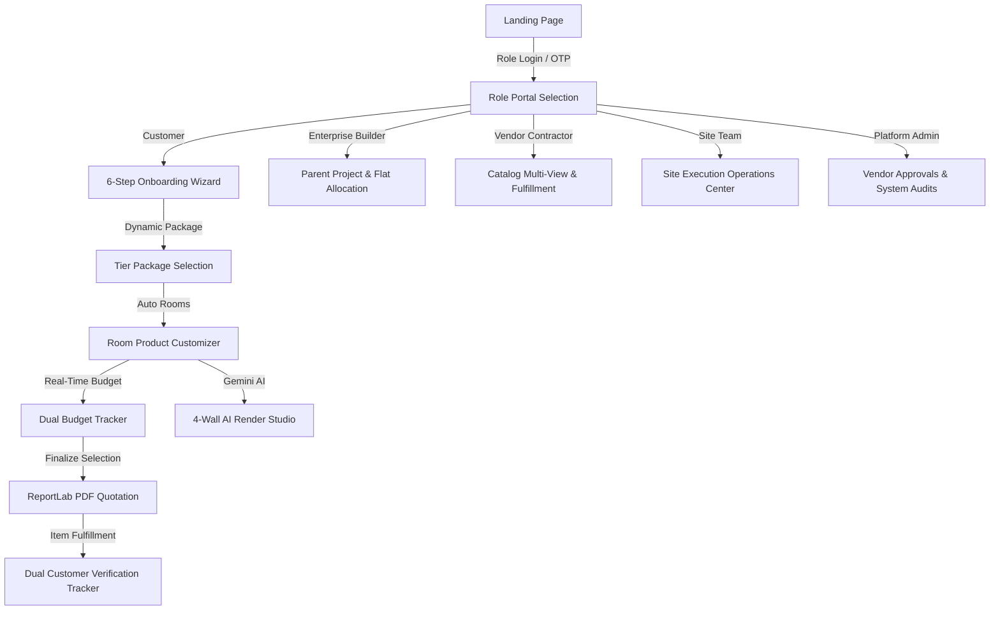

# 🏠 InteriorAI Platform

> **AI-Based Modular Interior Design & Execution Platform**

InteriorAI is an end-to-end web application that simplifies the interior design and execution journey for homeowners, real estate developers, contractors, site execution teams, and administrators. By combining interactive 3D/4-Wall rendering, AI photorealistic visualizations, real-time dynamic pricing updates, bank-compliant PDF quote generation, and contractor logistics tracking, the platform takes you from a blank BHK layout to a professional quotation and ready-to-execute design in under 10 minutes.

---

## 🌟 Key Features Across 5 Stakeholder Portals

### 1. Customer (Homeowner B2C) Portal
* **6-Step Interactive Onboarding Wizard**: Guided flow capturing project type (New Home vs. Renovation), BHK scope (1BHK to 5BHK), budget limit, completion timeline, single-select design vibe, wood laminate finish, fabric preference, and color explorer. Auto-saves draft project at Step 1 to track progress on the dashboard and resume exact steps without duplicate projects.
* **Dynamic Package Pricing**: Packages automatically compute tier prices based on onboarding budget limit (`Basic` = budget, `Premium` = budget + ₹2L, `Luxury` = budget + ₹5L).
* **Interactive 3D Room Canvas & 4-Wall AI Studio**: Powered by Three.js, `@react-three/fiber`, and Gemini / Imagen 3 AI. View Wall A, B, C, D perspectives, test blueprint templates, upload photo layouts, and input room dimensions with automatic pillar clearance.
* **Smart Customizer & Preference Indicator Legend**: Features a Preference Legend Card on section header and compact indicator dots on product cards (🟡 Material/Fabric, 🔵 Color, 🔴 Budget Cap). Customizes room items with live cost updates, dual budget tracking sub-boxes (*Remaining Budget* and *Variation Spent*), auto tab progression, balcony auto-complete, and all-complete panel.
* **ReportLab PDF Quotation Generator**: Generates professional, bank-compliant PDF quotes with detailed room line items, GST breakdown, terms, and bank details. Automatically regenerates quotes if revised after customer review.
* **Dual Customer Tracking System**: Read-only **Vendor Status Bar** visualizes item sourcing progress (Ordered to Dispatched) in real time; interactive **Customer Verification Bar** permits homeowners to confirm deliveries and installations.

### 2. Enterprise / Builder (B2B2C) Portal
* **4-Step Parent Project Creation Wizard**: Configure multi-unit parent projects with unit mix distributions (1BHK to 5BHK) and default design package assignments.
* **Flat Allocation & Token Invitations**: Assign customer details (Name, Email, Phone) to specific flat units and generate secure invitation tokens (`/invite`).
* **Portfolio Dashboard**: High-level portfolio completion metrics, flat allocation grids, and recent project activity timestamps.

### 3. Vendor (B2B) Portal
* **Vendor Onboarding & Document Verification**: Submit business details, GST/PAN numbers, and upload verification certificates for admin approval.
* **Vendor Management**: Vendor registration, document verification, multi-view catalog image uploads (Front/Side/Perspective), dynamic pincode order distribution, and milestone-based payout tracking.
* **Order Fulfillment & Logistics Tracking**: Accept/reject item assignments, update 6-stage milestone progress (PO Approved $\rightarrow$ Production $\rightarrow$ Ready $\rightarrow$ Dispatched), upload verification proof photos, and enter courier/vehicle tracking details.
* **Issues Tracking & Milestone Payouts**: Review customer-reported product issues (`/vendor/issues`) and track milestone-based payout releases.

### 4. Project Team / Site Execution Center
* **Welcome Portal & Role Router**: Role selection hub (`/team`) routing users to dedicated manager, coordinator, or technician consoles.
* **Role-Specific Execution Dashboards**:
  * **Manager Console (`/team/manager`)**: Portfolio metrics, active vs. delayed projects, team utilization rate, SLA performance metrics, resource assignments.
  * **Coordinator Console (`/team/coordinator`)**: Assigned projects, item sourcing tracking, vendor delay alerts, site visit scheduling, daily checklist forms.
  * **Technician Field Console (`/team/technician`)**: Today's installation tasks, daily checklists, direct proof photo uploads with multipart form support.
* **Operations Console**: Project execution workspace (`/projects/[projectId]/execution`) featuring item tracking, task calendars, checklists, site visit logs, document vault, and SLA delay reporting.

### 5. Admin Control Center
* **Unified Admin Portal Layout**: Super Admin console at `/admin` with persistent sidebar navigation across 11 specialized sub-routes.
* **11 Dedicated Admin Sub-Pages**:
  * **Client CRM (`/admin/customers`)**: Customer directory, profile management, account suspension, and reactivation. Auto-synced with enterprise project deletions to prevent ghost accounts.
  * **Enterprise Partner Management (`/admin/enterprise`)**: Isolated builder partner hub for developer accounts, parent property projects, unit mixes, and portfolio metrics.
  * **Vendor Governance (`/admin/vendors`)**: Onboarding application review, document inspection, approval, rejection, and suspension.
  * **Team Approvals (`/admin/project-team`)**: Pending team registration approvals and role matrix permissions assignment (`AdminRole`).
  * **Project Control Center (`/admin/projects`)**: Master project creation, manager/coordinator/technician/vendor resource assignment, project closing, and cancellation.
  * **Master Data Management (`/admin/master-data`)**: Master product catalog CRUD, CSV bulk import, and CSV export.
  * **Operational Reports (`/admin/reports`)**: Live CSV report generation for sales, revenue, projects, vendors, and customers.
  * **AI Engine Tuning (`/admin/ai-engine`)**: AI model selection, rendering parameters, and prompt customization templates.
  * **IT Box & System Settings (`/admin/settings`)**: Dynamic platform key-value settings management (`SystemSetting`).
  * **Audit Logs (`/admin/audit-log` & `/admin/activity-log`)**: Full administrative action trail (`AuditLog`) and real-time developer activity stream.

---

## 🛠️ Tech Stack

### Frontend (Next-Gen Web Interface)
* **Framework:** Next.js 14 (App Router) & React 18
* **Language:** TypeScript
* **Styling:** TailwindCSS & Framer Motion (micro-animations, swipe-to-delete notifications)
* **3D Graphics:** Three.js, `@react-three/fiber`, `@react-three/drei`
* **State Management:** Zustand (`authStore`, `projectStore`, `customerStore`, `vendorStore`, `projectTeamStore`)
* **Data Fetching:** SWR & Axios

### Backend (Robust RESTful API)
* **Framework:** FastAPI (Python 3.10+)
* **Server:** Uvicorn (ASGI)
* **Database ORM:** SQLAlchemy (SQLite database: `interior_ai.db`)
* **Data Validation:** Pydantic v2
* **Authentication:** JWT (JSON Web Tokens) via `python-jose` & `passlib` (Bcrypt)
* **PDF Generation:** ReportLab PDF library
* **AI Image Generation:** Google Gemini API / Imagen 3 / ControlNet rendering simulation
* **Image Processing:** Pillow

---

## 📁 Project Directory Structure

```text
Interior_Design/
├── Click_Run.bat           # Automated launcher (Backend + Frontend + DB Seeding)
├── AGENTS.md               # Root AI agent memory index & system rules
├── ARCHITECTURE.md         # Full System Architecture & Stakeholder Flow Diagrams
├── .gitignore              # Cleaned & deduplicated exclusion configuration
├── backend/
│   ├── AGENTS.md           # Backend architecture & router guide
│   ├── .env                # Server configuration & JWT secrets
│   ├── requirements.txt    # Python package dependencies
│   ├── interior_ai.db      # SQLite database instance
│   ├── pdfs/               # Generated quotation PDFs & uploaded floor plans
│   └── app/
│       ├── main.py         # FastAPI application entry point & router mounting
│       ├── db.py           # Database engine, session setup, and demo seeder
│       ├── models.py       # SQLAlchemy database schemas (User, Project, Room, Product, etc.)
│       ├── schemas.py      # Pydantic schemas for request/response validation
│       ├── auth_utils.py   # JWT token issuance and auth dependencies
│       ├── seed_data.py    # Seed scripts for products, packages, and vendors
│       ├── routers/        # 14 Modular API routers (auth, projects, catalog, vendors, team, etc.)
│       └── services/       # Core service modules (pdf_service.py, render_mock.py)
└── frontend/
    ├── AGENTS.md           # Frontend architecture & page routes guide
    ├── package.json        # NPM dependencies and scripts
    ├── next.config.js      # Next.js build options
    ├── tsconfig.json       # TypeScript configuration
    └── src/
        ├── app/            # Next.js App Router pages (30 routes across 5 portals)
        ├── components/     # Reusable UI widgets, CategoryDropdown, RoomCanvas3D
        ├── lib/            # Axios API client and color utilities
        └── stores/         # Zustand global state stores (5 stores)
```

---

## 🚀 Quick Start (Windows)

The repository includes an automated batch script that checks environment requirements, installs dependencies, seeds default data, and starts up both development servers.

1. Double-click **`Click_Run.bat`** at the root of the project folder.
2. The script will:
   * Validate **Python 3.10+** and **Node.js 18+**.
   * Create and activate a Python virtual environment (`.venv`) in `backend/` and install `requirements.txt`.
   * Run `npm install` in `frontend/`.
   * Initialize and seed the SQLite database with design packages, catalog products, and reviewer demo accounts.
   * Start the FastAPI backend server (`http://localhost:8000`) and the Next.js frontend (`http://localhost:3000`).
   * Automatically launch the web application in your browser at `http://localhost:3000`.

**Run modes.** By default the launcher builds the frontend once (`next build`, a few minutes) and serves the
compiled app, so every page opens instantly. It rebuilds only when the git commit changes. For editing code,
run **`Click_Run.bat dev`** instead: live reload, but each page compiles on its first visit (slow on low-RAM machines).

---

## 💻 Manual Setup (All Operating Systems)

To run the application components manually, open two terminal windows:

### 1. Backend Setup
```bash
cd backend
python -m venv .venv
source .venv/bin/activate       # On Windows: .venv\Scripts\activate
pip install -r requirements.txt
python -m uvicorn app.main:app --host 0.0.0.0 --port 8000 --reload
```
* **API Documentation**: Interactive Swagger UI is available at `http://localhost:8000/docs`.

### 2. Frontend Setup
```bash
cd frontend
npm install
npm run dev
```
* **Client Portal**: Access the web interface at `http://localhost:3000`.

---

## 🔄 System Architecture & Data Flow


```mermaid
graph TD
    A[Landing Page] -->|Role Login / OTP| B[Role Portal Selection]
    B -->|Customer| C[6-Step Onboarding Wizard]
    C -->|Dynamic Package| D[Tier Package Selection]
    D -->|Auto Rooms| E[Room Product Customizer]
    E -->|Real-Time Budget| F[Dual Budget Tracker]
    E -->|Gemini AI| G[4-Wall AI Render Studio]
    F -->|Finalize Selection| H[ReportLab PDF Quotation]
    H -->|Item Fulfillment| I[Dual Customer Verification Tracker]
    
    B -->|Enterprise Builder| J[Parent Project & Flat Allocation]
    B -->|Vendor Contractor| K[Catalog Multi-View & Fulfillment]
    B -->|Site Team| L[Site Execution Operations Center]
    B -->|Platform Admin| M[Vendor Approvals & System Audits]
```

---

## 🛡️ Security & Environment Configuration

Environment settings are managed via the `.env` file in `backend/`. Update default keys before deploying to production:

```env
DATABASE_URL=sqlite:///./interior_ai.db
JWT_SECRET=your_secure_production_jwt_secret_key_here
JWT_ALGORITHM=HS256
ACCESS_TOKEN_EXPIRE_MINUTES=60
PDF_OUTPUT_DIR=./pdfs

# Google AI Studio API Key for AI Photorealistic Room Rendering
GEMINI_KEY=your_gemini_api_key_here
# Model used for the paid post-payment render batch (feedback 1.8)
GEMINI_PREMIUM_MODEL=gemini-3-pro-image

# Offline payment details shown to customers (feedback 1.9).
# Leave unset and the payment page says the team will share them instead.
PAYMENT_ACCOUNT_NAME=
PAYMENT_ACCOUNT_NUMBER=
PAYMENT_IFSC=
PAYMENT_BANK_NAME=
PAYMENT_UPI_ID=
```

---

## 📋 Stakeholder Feedback Modules (September 2026 review)

| Area | What changed | Where |
|---|---|---|
| **AI visualisation** | The 3D viewer renders straight from the customer's onboarding answers (no second control panel); opens by default | `/visualize/[id]`, `GET /api/v1/ai/interactive-viewer/{id}`, `GET /api/v1/ai/viewer-brief/{id}` |
| 1.1 Floor plan | Upload at onboarding *or skip and upload later*; an uploaded plan is sent to the image model with every render | `/floor-layout/[id]`, `POST /api/v1/ai/floor-plan/{id}` |
| **Plan → 2D/3D** | An uploaded plan image is traced into rooms (walls incl. coloured CAD double lines, doors, windows), room names and the scale are read from the printed labels/sizes (offline OCR), the customer confirms them, and the 2D plan + 3D model are built from that layout. Stretched images are corrected from the printed sizes | `/plan-trace/[id]`, `/api/v1/ai/plan-layout/*`, `services/plan_layout.py`, `services/plan_ocr.py` |
| **Product options → 2D/3D/AI** | Every option chosen on Customize (colour, fabric, wood finish, size, texture, cushion style and any group a vendor adds) is saved, painted onto the matching piece in the 2D plan and 3D model, and written into the AI render prompt | `/customize/[id]`, `services/design_selections.py` |
| 1.3 / 1.4 GST & quotation ID | GSTIN/PAN/billing profile, frozen onto each quotation; `QT-YYYY-NNNNN` numbers on screen and PDF | `/profile/billing`, `PUT /api/v1/auth/me` |
| 1.5 / 1.9 / 1.10 | Admin quotation search → customer/project, mark paid offline, convert to project | `/admin/quotations`, `/api/v1/quotation-admin/*` |
| 1.6 Product images | Catalog re-encoded 495 MB → 7.6 MB WebP; uploads auto-optimised; relative image paths resolved | `ProductImage`, `services/image_optimizer.py` |
| 1.7 / 1.8 Rendering | Free AI visualisation; up to 20 premium renders unlocked by payment | `RenderEntitlementPanel`, `/api/v1/ai/premium-render/*` |
| 1.11 / 1.12 | B2C pays in full (B2B keeps milestones); pre-checkout page captures special services + confirmations | `/checkout/[id]`, `/api/v1/special-services/checkout/{id}` |
| 2.1–2.4 B2B | Project-level bulk discount, original vs discounted per unit, unit-wise roll-up, customisations | `/admin/approvals` (Pricing), enterprise project page |
| 3.1–3.5 Project team | Separate vendor and technician status tracks; technician sees only installation; photos on the item | `ItemTrackingBoard`, `/api/v1/item-tracking/*` |
| 4.1–4.5 Vendor | Mark product unavailable (hidden from marketplace); admin approval queue; supplier allocation after approval | `/vendor/products`, `/admin/approvals`, `/api/v1/approvals/*` |
| 5.1–5.8 Special services | Consultant directory & onboarding, lead routing, consultant portal, commission ledger | `/admin/special-services`, `/consultant`, `/api/v1/special-services/*` |

### Running the tests

```bash
cd backend
.venv\Scripts\python -m pytest tests -q          # feedback modules, end to end (throwaway DB)

cd ../backend-ai
..\backend\.venv\Scripts\python -m pytest tests -q   # IDS solver / pricing engine
```

### Floor-plan reader: data, scoring and tuning

The plan reader (`services/plan_layout.py`, `plan_ocr.py`, `plan_sheet.py`) is rules plus OCR, not a
neural network. Its thresholds live in `plan_layout.TUNING` and are fitted on labelled plans.

| Data | Where | Labels |
|---|---|---|
| 21 real brochure plans (WhatsApp) | `backend/plan_dataset/images/` | `ground_truth.json`, `annotations.json`; 14 train / 7 test |
| 70 damaged copies of the real *train* plans | `backend/plan_dataset/augmented/` (generated, git-ignored) | inherited from the originals |
| 600 synthetic plans, 7,844 rooms | `backend/plan_dataset/synthetic/` (generated, git-ignored) | exact room boxes, types, areas; 420 train / 90 val / 90 test |

The synthetic plans reproduce what real brochures do: 8 drawing styles (colour-coded area-only,
line drawings, single- and double-line CAD, grey fills, numbered rooms with a key, furnished
renders), 7 label formats (metres, mm, feet-inches, m², dual units…), multi-flat sheets (side by side,
2×2 grid, mirrored floor plates, stacked) and WhatsApp damage (JPEG, blur, stretch, crop, mirror
flips, screenshot icons). They regenerate exactly from a seed, so they are not committed.

```bash
cd backend
.venv\Scripts\python scripts\synth_plans.py --count 600 --seed 7    # synthetic plans
.venv\Scripts\python scripts\augment_real.py --copies 5             # damaged copies of real train plans
.venv\Scripts\python scripts\plan_eval.py --split test              # score on the real plans
.venv\Scripts\python scripts\plan_eval_synth.py --split val         # score on synthetic plans, room by room
.venv\Scripts\python scripts\tune_plan_reader.py --per-style 6      # fit TUNING on train plans only
```

Validation and test plans — synthetic and real — are never used for tuning. OCR results are cached
in `plan_dataset/ocr_cache/`, so repeated scoring only redoes the geometry. Scoring the full synthetic
set takes about an hour on a 4 GB laptop; close other programs first.

### Notes

* Without a confirmed floor plan the 3D model uses the pre-solved standard layout for the BHK. Once the customer confirms the rooms traced from their plan, the 2D plan and 3D model are built from that plan instead ("Use standard layout" switches back).
* Plan tracing reads room labels with RapidOCR (`rapidocr-onnxruntime`, installed from `requirements.txt`, runs offline). If `GEMINI_KEY` is set, Gemini vision is tried first. Detection is a starting point: the customer can move, resize, rename and add rooms before generating.
* Projects that existed before the approval queue were marked approved on migration, so live work is not frozen. New projects enter the queue.
---

## 🧠 AI Companion Recommendation Engine

The InteriorAI recommendation engine (`backend/app/routers/recommendations.py`) provides intelligent real-time pairing suggestions as users customize each room. Instead of static upsells, it utilizes dynamic room anchors, color palette harmony matrices, and category budget caps.

### 1. Anchor-Driven Pairing Graph
Recommendations are keyed off the dominant functional anchor of each room type:
* **Living Room:** `Sofa` is the primary anchor. Recommends Coffee Tables, Accent Rugs, Media Units, and Floor Lamps.
* **Bedroom / Master Bedroom:** `Bed` is the anchor. Recommends Bedside Nightstands, Wardrobes, and Accent Chairs.
* **Dining Room:** `Dining Table` is the anchor. Recommends Dining Chairs, Bar Cabinets, and Pendant Lights.
* **Kitchen & Balcony:** Countertops and Planter stands anchor functional accessory pairings.

### 2. Multi-Dimensional Scoring Function
Pairs are evaluated across a 100-point normalized scoring rubric:
$$\text{Score} = w_{\text{style}} \cdot S_{\text{style}} + w_{\text{palette}} \cdot S_{\text{palette}} + w_{\text{material}} \cdot S_{\text{material}} + w_{\text{budget}} \cdot S_{\text{budget}} + w_{\text{spatial}} \cdot S_{\text{spatial}}$$

* **Style Compatibility ($w=0.25$):** Matches stylistic vibe (Modern, Scandinavian, Minimalist, Boho, Industrial, Luxury).
* **Color Harmony ($w=0.25$):** Evaluated against the 60-30-10 interior rule via `COLOR_HARMONY_MAP` (e.g., Warm Beige anchors pair with Terracotta, Forest Green, or Cream).
* **Material & Texture Cohesion ($w=0.20$):** Aligns secondary finishes (e.g., Walnut veneer with Matte Black metal; Teak with Brass accents).
* **Budget Proportionality ($w=0.15$):** Caps item cost dynamically within the allocated category tier to prevent budget exhaustion.
* **Spatial Feasibility ($w=0.15$):** Validates physical dimensions against room footprint and circulation envelopes.
---

## 📐 Spatial Feasibility & Clearance Constraints Engine

To prevent users from selecting furniture that physically over-allocates the floor plate or blocks walking paths, the recommendation engine includes an automated spatial feasibility solver.

### 1. Walkway Circulation Envelope
* **850 mm Primary Clearance:** Enforces a minimum unimpeded circulation buffer around large anchor pieces (e.g., bed perimeter to wall/wardrobe, sofa to TV console).
* **450 mm Secondary Clearance:** Enforces ergonomic clearance between intimate pairings, such as coffee table to sofa edge.

### 2. Room Floor Plate Ratio & Area Caps
* Total furniture footprint is capped at **40% of net carpet area** in living rooms and bedrooms to prevent visual clutter and maintain comfortable airflow.
* In compact rooms ($< 120\text{ sq.ft}$), items exceeding proportional depth ($> 650\text{ mm}$ for desks or $> 900\text{ mm}$ for accent tables) are flagged with spatial warnings.

### 3. Automated Alternative Swaps
When an item is flagged for spatial or budget constraints:
* The engine queries the catalog for alternative SKUs within the same style cluster that have compact footprints (e.g., swapping a 6-seater rectangular dining table with a 4-seater round pedestal table).
* Returns candidate swaps with explicit delta attributes: footprint savings in $\text{sq.ft}$ and price difference in INR.
