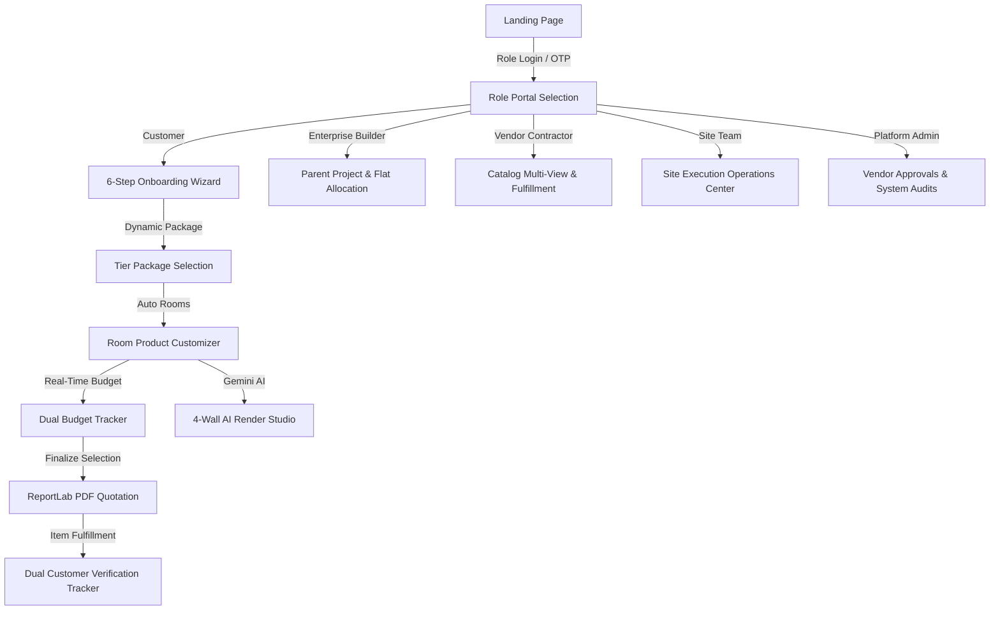

<p align="center">
  
</p>

# <p align="center">InteriorAI Platform</p>

<p align="center">
  <strong>End-to-End AI-Powered Modular Interior Design & Execution Platform</strong><br>
  <em>Unifying Homeowners (B2C), Enterprise Builders (B2B2C), Furniture Vendors (B2B), Site Operations & Admins</em>
</p>

<p align="center">
  
  
  
  
  
  
</p>

---

## 🌟 Key Features Across 5 Stakeholder Portals

### 1. Customer (Homeowner B2C) Portal
* **6-Step Interactive Onboarding Wizard**: Guided flow capturing project type (New Home vs. Renovation), BHK scope (1BHK to 5BHK), budget limit, completion timeline, single-select design vibe, wood laminate finish, fabric preference, and color explorer. Auto-saves draft project at Step 1 to track progress on the dashboard and resume exact steps without duplicate projects.
* **Dynamic Package Pricing & Strict Budget Bracket Scaling**: Packages compute tier prices anchored to the user's budget bracket (`Basic` = budget minimum, `Premium` = budget + ₹2L, `Luxury` = budget + ₹5L). Strictly enforces linear product catalog price caps across tiers (₹3L–₹5L: max ₹75k; ₹5L–₹8L: max ₹1.25L; ₹8L–₹12L: max ₹2L; ₹12L–₹20L: max ₹3.5L; ₹20L+: max ₹5L).
* **Interactive 3D Room Canvas & 4-Wall AI Studio**: Powered by Three.js, `@react-three/fiber`, and Gemini / Imagen 3 AI. View Wall A, B, C, D perspectives, test blueprint templates, upload photo layouts, and input room dimensions with automatic pillar clearance.
* **Redesigned Customizer Studio & Real-Time Stock Status**:
  * **Cohesive Header & Base Price Alignment**: Prominent Base Price pill placed directly beside the product title with zero wasted layout space.
  * **Interactive About $\leftrightarrow$ Variants Flip Toggle**: Seamless toggle between technical product specifications (`Dimensions`, `Material`, `Mounting`, `Assembly`) and custom styling variants (`Colors`, `Fabrics`, `Textures`).
  * **Full-Width Curated Pairings Grid**: "Complete the Room" AI pairings rendered in an expansive 2-column responsive layout with real-time remaining room budget buffer tracking and side-by-side single vs. bundle save buttons.
  * **Real-Time Stock Status**: Real-time stock availability badges (In Stock, Low Stock ≤ 5, Out of Stock) with automatic suppression of depleted SKUs from customizer room grids.
* **ReportLab PDF Quotation Generator**: Generates professional, bank-compliant PDF quotes with detailed room line items, GST breakdown, terms, and bank details. Automatically reserves inventory upon quote creation and regenerates quotes if revised after customer review.
* **Multi-Channel Milestone Payments Hub (`/track/[projectId]/payments`)**: Structured payment disbursements aligned with execution milestones (e.g. Booking Advance, Production Start, Dispatch, Installation Completion). Supports 4 payment modes: Card, UPI, Netbanking, and **Offline / Bank Transfer (NEFT/RTGS/IMPS)** with UTR reference validation and transaction confirmation.
* **Unified Customer Project Progress & Snag Cockpit (`/track/[projectId]`)**:
  * **Single-Project Consolidated Dashboard**: Converted execution projects consolidate into a single clean active card on the dashboard, displaying the live **"In Execution"** badge and a direct 1-click **"Project Progress"** button.
  * **Hero Execution Banner**: Milestone-driven overall progress gauge (0–100%) and expandable 6-stage core timeline (Design Finalized $\rightarrow$ Procurement $\rightarrow$ Production $\rightarrow$ Logistics $\rightarrow$ Installation $\rightarrow$ Handover) with **strictly zero dates or day forecasts**.
  * **Sourcing & Room Filter Bar**: 7 interactive status counter chips (All Items, Ordered, In Production, Quality Check, Dispatched, Delivered, Installation, Completed) with room filter tabs and instant component search.
  * **In-Page Component Tracking Details**: Deep-dive component view featuring **Dual-Track Status Bars** (Vendor Sourcing vs Field Installation), component proof photo gallery with high-res lightbox, full technical specifications, carrier/waybill logistics metadata, and immutable milestone audit history.
  * **Customer Snag & Defect Filing Flow**: Direct defect reporting with target component context banner, category & severity selectors, date encountered input, detailed description, and drag-and-drop multi-photo upload with thumbnail preview removal.
  * **2x2 Project Utilities Grid**: 1-click modal access to Quotation & Invoice PDFs, AI 3D Visualizer Studio, Architectural Floor Plans, and Milestone Payments.

### 2. Enterprise / Builder (B2B2C) Portal
* **4-Step Parent Project Creation Wizard & Typology Setup**: Configure multi-unit parent projects with unit mix distributions (1BHK to 5BHK), default design package assignments, and dynamic architectural typologies. Enforces mandatory blueprint layout uploads with dynamic $N-1$ tolerance ($\max(1, N-1)$ blueprints required), carpet area validation, and real-time card readiness badges (`✓ Blueprint Ready`, `⚠ Blueprint Required`, `Optional Pending`) guarding project finalization.
* **Project Typologies Shelf & Interactive Flat Allocation (`/enterprise/projects/[id]/units`)**:
  * Visual typology cards displaying blueprint thumbnails, square footage, assigned flat counts, and quick-filter unit views.
  * **Assign to Flats Multi-Column Modal**: Interactive allocation grid grouped dynamically by BHK columns (e.g. 2BHK, 3BHK, 4BHK), displaying flat numbers, current typology assignments (or Empty), and instant toggle assignments with green/neutral visual indicators. Enterprise-locked to prevent buyer override.
* **B2B Bulk Project Discounts & Unit-Wise Pricing Engine**:
  * Automated volume discount tiering engine (5–10 units: 5%, 11–25 units: 8%, 26–50 units: 12%, 50+ units: 15%).
  * Transparent project summary cards displaying Total Units, Gross Portfolio Value, Total Bulk Savings (₹ / %), and Net Portfolio Cost.
  * Itemized unit customization breakdown tables tracking base package costs, customization upgrades, volume discount deductions, and final net flat prices.
* **Flat Allocation & Token Invitations**: Assign buyer details (Name, Email, Phone) to specific flat units and generate secure invitation tokens (`/invite`).
* **Portfolio Dashboard**: High-level portfolio completion metrics, flat allocation grids, and recent project activity timestamps.

### 3. Vendor (B2B) Portal
* **Real-Time Inventory Locking & Atomic Stock Reservation (`/vendor/inventory`)**:
  * Live stock ledger displaying total physical stock, active quotation reservations, and net available stock.
  * Atomic stock reservation lifecycle: Quote creation automatically reserves items; quote cancellation or expiry releases reservations back to stock; quote payment / project conversion commits reservations into permanent orders.
  * Real-time out-of-stock catalog suppression: Depleted SKUs are automatically hidden or marked unavailable in the customer customizer.
  * Quick stock adjustments and instant live/hidden visibility toggle per SKU.
* **Vendor Onboarding & Document Verification**: Submit business details, GST/PAN numbers, and upload verification certificates for admin approval.
* **Multi-View Catalog Management**: Manage product inventory with multi-view perspective images (Front/Side/Perspective) and dynamic pincode order distribution.
* **Order Fulfillment & Logistics Tracking**: Accept/reject item assignments, update 6-stage milestone progress (PO Approved $\rightarrow$ Production $\rightarrow$ Ready $\rightarrow$ Dispatched), upload verification proof photos, and enter courier/vehicle tracking details.
* **Issues Tracking & Milestone Payouts**: Review customer-reported product issues (`/vendor/issues`) and track milestone-based payout releases.

### 4. Project Team / Site Execution Center
* **Welcome Portal & Role Router**: Role selection hub (`/team`) routing users to dedicated manager, coordinator, or technician consoles with sleek indigo design accents.
* **Role-Specific Execution Dashboards**:
  * **Manager Console (`/team/manager`)**: Portfolio velocity metrics, active vs. delayed projects, team utilization rates, SLA performance analytics, vendor/technician resource assignments.
  * **Coordinator Console (`/team/coordinator`)**: Assigned projects, item sourcing tracking, vendor delay alerts, site visit scheduling, daily site checklists.
  * **Technician Field Console (`/team/technician`)**: Today's assigned installation items, daily checklists, direct mobile photo proof uploads with multipart form support, and instant status updates.
* **Unified Project Execution Workspace (`/projects/[projectId]/execution`)**:
  * **Interactive Execution Cockpit**: Hero progress banner with dynamic circular progress gauge (0–100%) and expandable 6 Core Stages Timeline with **strictly zero dates or day forecasts** (Design Finalized $\rightarrow$ Procurement $\rightarrow$ Production $\rightarrow$ Logistics $\rightarrow$ Installation $\rightarrow$ Handover).
  * **Dual-Track Item Progression**: Simultaneous tracking of Vendor Sourcing (PO Approved $\rightarrow$ Dispatched $\rightarrow$ Delivered) and Site Installation (Site Received $\rightarrow$ Quality Checked $\rightarrow$ Customer Verified).
  * **Execution Tools**: Gantt timeline view, on-site checklist verification, site visit logs, document vault, customer call logs, and SLA delay notifications.

### 5. Admin Control Center
* **Unified Admin Portal Layout**: Super Admin console at `/admin` with persistent sidebar navigation across 12 specialized sub-routes.
* **Dedicated Admin Control Sub-Pages**:
  * **Approvals & Supplier Gate (`/admin/approvals`)**: Mandatory approval queue (`Project.approval_status = PENDING`) gating vendor allocation; item assignments remain locked until admin approves the project and assigns the vendor.
  * **Quotation Admin & Conversions (`/admin/quotations`)**: Search quotations across customers/projects, review offline/bank payments, verify UTR numbers, and 1-click convert paid quotations into active execution projects (`converted_from_project_id`).
  * **Client CRM (`/admin/customers`)**: Directory of customer accounts, profile editing, suspension, and reactivation. Auto-synced with enterprise project deletions to prevent orphaned/ghost accounts.
  * **Enterprise Partner Management (`/admin/enterprise`)**: Dedicated management page for B2B real-estate builder accounts, parent property setups, unit mixes, and developer portfolios.
  * **Vendor Governance (`/admin/vendors`)**: Onboarding application review, document inspection, approval, rejection, and suspension.
  * **Team Approvals (`/admin/project-team`)**: Pending team registration approvals and role matrix permissions assignment (`AdminRole`).
  * **Project Control Center (`/admin/projects`)**: Master project creation, manager/coordinator/technician/vendor resource assignment, project closing, and cancellation.
  * **Master Data Management (`/admin/master-data`)**: Master product catalog CRUD, CSV bulk import, and CSV export.
  * **Operational Reports (`/admin/reports`)**: Live CSV report generation for sales, revenue, projects, vendors, and customers.
  * **AI Engine Tuning (`/admin/ai-engine`)**: AI model selection, rendering parameters, and prompt customization templates.
  * **IT Box & System Settings (`/admin/settings`)**: Dynamic platform key-value settings management (`SystemSetting`).
  * **Audit Trail & System Logs (`/admin/audit-log` & `/admin/activity-log`)**: Full administrative action trail (`AuditLog`) and real-time developer activity stream.

---

## 🛠️ Tech Stack

### Frontend (Next-Gen Web Interface)
* **Framework:** Next.js 14 (App Router) & React 18
* **Language:** TypeScript
* **Styling:** TailwindCSS & Framer Motion (micro-animations, swipe-to-delete notifications)
* **3D Graphics:** Three.js, `@react-three/fiber`, `@react-three/drei`
* **State Management:** Zustand (`authStore`, `projectStore`, `customerStore`, `vendorStore`, `projectTeamStore`)
* **Data Fetching:** SWR & Axios

### Backend (Robust RESTful API)
* **Framework:** FastAPI (Python 3.10+)
* **Server:** Uvicorn (ASGI)
* **Database ORM:** SQLAlchemy (SQLite database: `interior_ai.db`)
* **Data Validation:** Pydantic v2
* **Authentication:** JWT (JSON Web Tokens) via `python-jose` & `passlib` (Bcrypt)
* **PDF Generation:** ReportLab PDF library
* **AI Image Generation:** Google Gemini API / Imagen 3 / ControlNet rendering simulation
* **Image Processing:** Pillow

---

## 📁 Project Directory Structure

```text
Interior_Design/
├── Click_Run.bat           # Automated launcher (Backend + Frontend + DB Seeding)
├── AGENTS.md               # Root AI agent memory index & system rules
├── ARCHITECTURE.md         # Full System Architecture & Stakeholder Flow Diagrams
├── .gitignore              # Cleaned & deduplicated exclusion configuration
├── backend/
│   ├── AGENTS.md           # Backend architecture & router guide
│   ├── .env                # Server configuration & JWT secrets
│   ├── requirements.txt    # Python package dependencies
│   ├── interior_ai.db      # SQLite database instance
│   ├── pdfs/               # Generated quotation PDFs & uploaded floor plans
│   └── app/
│       ├── main.py         # FastAPI application entry point & router mounting
│       ├── db.py           # Database engine, session setup, and demo seeder
│       ├── models.py       # SQLAlchemy database schemas (User, Project, Room, Product, etc.)
│       ├── schemas.py      # Pydantic schemas for request/response validation
│       ├── auth_utils.py   # JWT token issuance and auth dependencies
│       ├── seed_data.py    # Seed scripts for products, packages, and vendors
│       ├── routers/        # 14 Modular API routers (auth, projects, catalog, vendors, team, etc.)
│       └── services/       # Core service modules (pdf_service.py, render_mock.py)
└── frontend/
    ├── AGENTS.md           # Frontend architecture & page routes guide
    ├── package.json        # NPM dependencies and scripts
    ├── next.config.js      # Next.js build options
    ├── tsconfig.json       # TypeScript configuration
    └── src/
        ├── app/            # Next.js App Router pages (30 routes across 5 portals)
        ├── components/     # Reusable UI widgets, CategoryDropdown, RoomCanvas3D
        ├── lib/            # Axios API client and color utilities
        └── stores/         # Zustand global state stores (5 stores)
```

---

## 🚀 Quick Start (Windows)

The repository includes an automated batch script that checks environment requirements, installs dependencies, seeds default data, and starts up both development servers.

1. Double-click **`Click_Run.bat`** at the root of the project folder.
2. The script will:
   * Validate **Python 3.10+** and **Node.js 18+**.
   * Create and activate a Python virtual environment (`.venv`) in `backend/` and install `requirements.txt`.
   * Run `npm install` in `frontend/`.
   * Initialize and seed the SQLite database with design packages, catalog products, and reviewer demo accounts.
   * Start the FastAPI backend server (`http://localhost:8000`) and the Next.js frontend (`http://localhost:3000`).
   * Automatically launch the web application in your browser at `http://localhost:3000`.

**Run modes.** By default the launcher builds the frontend once (`next build`, a few minutes) and serves the
compiled app, so every page opens instantly. It rebuilds only when the git commit changes. For editing code,
run **`Click_Run.bat dev`** instead: live reload, but each page compiles on its first visit (slow on low-RAM machines).

---

## 💻 Manual Setup (All Operating Systems)

To run the application components manually, open two terminal windows:

### 1. Backend Setup (FastAPI & SQLite)
```bash
cd backend

# Create & activate Python virtual environment
python -m venv .venv
source .venv/bin/activate       # On Windows: .venv\Scripts\activate

# Install dependencies
pip install --upgrade pip
pip install -r requirements.txt

# Start backend server
python -m uvicorn app.main:app --host 0.0.0.0 --port 8000 --reload
```
* **API Server**: Available at `http://localhost:8000`.
* **Health Check**: `http://localhost:8000/health` (returns `{"status":"ok", ...}`).
* **Interactive API Documentation (Swagger)**: Available at `http://localhost:8000/docs`.
* **Database & Seed**: On first startup, `backend/interior_ai.db` is initialized and seeded automatically.

### 2. Frontend Setup (Next.js 14)
```bash
cd frontend

# Install Node dependencies
npm install

# Start development server
npm run dev
```
* **Client Portal**: Access the web interface at `http://localhost:3000`.
* **API Proxy**: Next.js automatically proxies all `/api/v1/*` requests and `/static/*` assets directly to `http://localhost:8000`.

---

## 🔄 System Architecture & Data Flow


```mermaid
graph TD
    A[Landing Page] -->|Role Login / OTP| B[Role Portal Selection]
    B -->|Customer| C[6-Step Onboarding Wizard]
    C -->|Dynamic Package| D[Tier Package Selection]
    D -->|Auto Rooms| E[Room Product Customizer]
    E -->|Real-Time Budget| F[Dual Budget Tracker]
    E -->|Gemini AI| G[4-Wall AI Render Studio]
    F -->|Finalize Selection| H[ReportLab PDF Quotation]
    H -->|Item Fulfillment| I[Dual Customer Verification Tracker]
    
    B -->|Enterprise Builder| J[Parent Project & Flat Allocation]
    B -->|Vendor Contractor| K[Catalog Multi-View & Fulfillment]
    B -->|Site Team| L[Site Execution Operations Center]
    B -->|Platform Admin| M[Vendor Approvals & System Audits]
```

---

## 🛡️ Security & Environment Configuration

Environment settings are managed via the `.env` file in `backend/`. Update default keys before deploying to production:

```env
DATABASE_URL=sqlite:///./interior_ai.db
JWT_SECRET=your_secure_production_jwt_secret_key_here
JWT_ALGORITHM=HS256
ACCESS_TOKEN_EXPIRE_MINUTES=60
PDF_OUTPUT_DIR=./pdfs

# Google AI Studio API Key for AI Photorealistic Room Rendering
GEMINI_KEY=your_gemini_api_key_here
# Model used for the paid post-payment render batch (feedback 1.8)
GEMINI_PREMIUM_MODEL=gemini-3-pro-image

# Offline payment details shown to customers (feedback 1.9).
# Leave unset and the payment page says the team will share them instead.
PAYMENT_ACCOUNT_NAME=
PAYMENT_ACCOUNT_NUMBER=
PAYMENT_IFSC=
PAYMENT_BANK_NAME=
PAYMENT_UPI_ID=
```

---

## 📋 Stakeholder Feedback Modules (September 2026 review)

| Area | What changed | Where |
|---|---|---|
| **AI visualisation** | The 3D viewer renders straight from the customer's onboarding answers (no second control panel); opens by default | `/visualize/[id]`, `GET /api/v1/ai/interactive-viewer/{id}`, `GET /api/v1/ai/viewer-brief/{id}` |
| 1.1 Floor plan | Upload at onboarding *or skip and upload later*; an uploaded plan is sent to the image model with every render | `/floor-layout/[id]`, `POST /api/v1/ai/floor-plan/{id}` |
| **Plan → 2D/3D** | An uploaded plan image is traced into rooms (walls incl. coloured CAD double lines, doors, windows), room names and the scale are read from the printed labels/sizes (offline OCR), the customer confirms them, and the 2D plan + 3D model are built from that layout. Stretched images are corrected from the printed sizes | `/plan-trace/[id]`, `/api/v1/ai/plan-layout/*`, `services/plan_layout.py`, `services/plan_ocr.py` |
| **Product options → 2D/3D/AI** | Every option chosen on Customize (colour, fabric, wood finish, size, texture, cushion style and any group a vendor adds) is saved, painted onto the matching piece in the 2D plan and 3D model, and written into the AI render prompt | `/customize/[id]`, `services/design_selections.py` |
| 1.3 / 1.4 GST & quotation ID | GSTIN/PAN/billing profile, frozen onto each quotation; `QT-YYYY-NNNNN` numbers on screen and PDF | `/profile/billing`, `PUT /api/v1/auth/me` |
| 1.5 / 1.9 / 1.10 | Admin quotation search → customer/project, mark paid offline, convert to project | `/admin/quotations`, `/api/v1/quotation-admin/*` |
| 1.6 Product images | Catalog re-encoded 495 MB → 7.6 MB WebP; uploads auto-optimised; relative image paths resolved | `ProductImage`, `services/image_optimizer.py` |
| 1.7 / 1.8 Rendering | Free AI visualisation; up to 20 premium renders unlocked by payment | `RenderEntitlementPanel`, `/api/v1/ai/premium-render/*` |
| 1.11 / 1.12 | B2C pays in full (B2B keeps milestones); pre-checkout page captures special services + confirmations | `/checkout/[id]`, `/api/v1/special-services/checkout/{id}` |
| 2.1–2.4 B2B Typologies & Discounts | Architectural typology setup, floor plans per typology, interactive BHK-column flat allocation, tiered volume discounts (up to 15%), and transparent unit customization breakdown | `/enterprise/projects/[id]/units`, `services/business_rules.py`, `models.py` |
| **Typology Blueprint Validation** | Step 4 wizard enforces $\max(1, N-1)$ mandatory blueprint layout uploads with positive carpet area and dynamic card readiness badges before project creation | `/enterprise/create-project`, `services/business_rules.py` |
| **Customizer Studio Universal Redesign** | Cohesive base price header, interactive About $\leftrightarrow$ Variants flip toggle, and full-width 2-column AI Curated Pairings grid with live remaining budget buffer tracking | `/customize/[id]`, `frontend/src/app/customize/*` |
| **Customer Dashboard & Progress Integration** | Single-card active project consolidation (hiding superseded quotation drafts), live "In Execution" badge, and direct 1-click "Project Progress" button | `/dashboard`, `/track/[projectId]`, `routers/projects.py` |
| 3.1–3.5 Unified Progress & Snags | Consolidated tracking cockpit with hero progress gauge, 6 stages (strictly milestone-driven, no dates), dual-track sourcing & installation, in-page component specs, and photo snag filing | `/track/[projectId]`, `customerStore.ts`, `/api/v1/customer/projects/{id}/*` |
| 3.6 Site Execution Workspace | Team execution workspace with 0–100% progress gauge, 6 core stages (strictly zero dates policy), dual-track sourcing vs installation, Gantt timeline, on-site checklists, and mobile photo proof uploads | `/projects/[projectId]/execution`, `/team/*`, `/api/v1/team/*` |
| 4.1–4.5 Vendor Inventory & Locking | Real-time stock ledger, atomic quotation stock reservation & release lifecycle, and instant out-of-stock catalog suppression | `/vendor/inventory`, `/customize/[id]`, `services/inventory_service.py` |
| 4.2–4.5 Admin Approvals & Supplier Gate | Mandatory approval queue (`Project.approval_status = PENDING`); vendor allocation locked until admin approval and supplier assignment | `/admin/approvals`, `services/business_rules.py` |
| 1.9 / 1.10 Milestone Payments & Offline NEFT | Customer payments hub with Card, UPI, Netbanking, and Offline / NEFT transfer recording with UTR reference validation; admin quotation search and 1-click project conversion | `/track/[projectId]/payments`, `/admin/quotations`, `/api/v1/quotation-admin/*` |
| Dynamic Budget Scaling & Catalog Caps | 3-tier scaling anchored to bracket minimums (`Basic` = budget, `Premium` = +₹2L, `Luxury` = +₹5L) with linear product price caps (₹75k to ₹5L) | `/onboarding`, `/customize/[id]`, `services/business_rules.py` |
| 5.1–5.8 Special services | Consultant directory & onboarding, lead routing, consultant portal, commission ledger | `/admin/special-services`, `/consultant`, `/api/v1/special-services/*` |

### Running the tests

```bash
cd backend
.venv\Scripts\python -m pytest tests -q          # feedback modules, end to end (throwaway DB)

cd ../backend-ai
..\backend\.venv\Scripts\python -m pytest tests -q   # IDS solver / pricing engine
```

### Floor-plan reader: data, scoring and tuning

The plan reader (`services/plan_layout.py`, `plan_ocr.py`, `plan_sheet.py`) is rules plus OCR, not a
neural network. Its thresholds live in `plan_layout.TUNING` and are fitted on labelled plans.

| Data | Where | Labels |
|---|---|---|
| 21 real brochure plans (WhatsApp) | `backend/plan_dataset/images/` | `ground_truth.json`, `annotations.json`; 14 train / 7 test |
| 70 damaged copies of the real *train* plans | `backend/plan_dataset/augmented/` (generated, git-ignored) | inherited from the originals |
| 600 synthetic plans, 7,844 rooms | `backend/plan_dataset/synthetic/` (generated, git-ignored) | exact room boxes, types, areas; 420 train / 90 val / 90 test |

The synthetic plans reproduce what real brochures do: 8 drawing styles (colour-coded area-only,
line drawings, single- and double-line CAD, grey fills, numbered rooms with a key, furnished
renders), 7 label formats (metres, mm, feet-inches, m², dual units…), multi-flat sheets (side by side,
2×2 grid, mirrored floor plates, stacked) and WhatsApp damage (JPEG, blur, stretch, crop, mirror
flips, screenshot icons). They regenerate exactly from a seed, so they are not committed.

```bash
cd backend
.venv\Scripts\python scripts\synth_plans.py --count 600 --seed 7    # synthetic plans
.venv\Scripts\python scripts\augment_real.py --copies 5             # damaged copies of real train plans
.venv\Scripts\python scripts\plan_eval.py --split test              # score on the real plans
.venv\Scripts\python scripts\plan_eval_synth.py --split val         # score on synthetic plans, room by room
.venv\Scripts\python scripts\tune_plan_reader.py --per-style 6      # fit TUNING on train plans only
```

Validation and test plans — synthetic and real — are never used for tuning. OCR results are cached
in `plan_dataset/ocr_cache/`, so repeated scoring only redoes the geometry. Scoring the full synthetic
set takes about an hour on a 4 GB laptop; close other programs first.

### Notes

* Without a confirmed floor plan the 3D model uses the pre-solved standard layout for the BHK. Once the customer confirms the rooms traced from their plan, the 2D plan and 3D model are built from that plan instead ("Use standard layout" switches back).
* Plan tracing reads room labels with RapidOCR (`rapidocr-onnxruntime`, installed from `requirements.txt`, runs offline). If `GEMINI_KEY` is set, Gemini vision is tried first. Detection is a starting point: the customer can move, resize, rename and add rooms before generating.
* Projects that existed before the approval queue were marked approved on migration, so live work is not frozen. New projects enter the queue.
---

## 🧠 AI Companion Recommendation Engine

The InteriorAI recommendation engine (`backend/app/routers/recommendations.py`) provides intelligent real-time pairing suggestions as users customize each room. Instead of static upsells, it utilizes dynamic room anchors, color palette harmony matrices, and category budget caps.

### 1. Anchor-Driven Pairing Graph
Recommendations are keyed off the dominant functional anchor of each room type:
* **Living Room:** `Sofa` is the primary anchor. Recommends Coffee Tables, Accent Rugs, Media Units, and Floor Lamps.
* **Bedroom / Master Bedroom:** `Bed` is the anchor. Recommends Bedside Nightstands, Wardrobes, and Accent Chairs.
* **Dining Room:** `Dining Table` is the anchor. Recommends Dining Chairs, Bar Cabinets, and Pendant Lights.
* **Kitchen & Balcony:** Countertops and Planter stands anchor functional accessory pairings.

### 2. Multi-Dimensional Scoring Function
Pairs are evaluated across a 100-point normalized scoring rubric:
$$\text{Score} = w_{\text{style}} \cdot S_{\text{style}} + w_{\text{palette}} \cdot S_{\text{palette}} + w_{\text{material}} \cdot S_{\text{material}} + w_{\text{budget}} \cdot S_{\text{budget}} + w_{\text{spatial}} \cdot S_{\text{spatial}}$$

* **Style Compatibility ($w=0.25$):** Matches stylistic vibe (Modern, Scandinavian, Minimalist, Boho, Industrial, Luxury).
* **Color Harmony ($w=0.25$):** Evaluated against the 60-30-10 interior rule via `COLOR_HARMONY_MAP` (e.g., Warm Beige anchors pair with Terracotta, Forest Green, or Cream).
* **Material & Texture Cohesion ($w=0.20$):** Aligns secondary finishes (e.g., Walnut veneer with Matte Black metal; Teak with Brass accents).
* **Budget Proportionality ($w=0.15$):** Caps item cost dynamically within the allocated category tier to prevent budget exhaustion.
* **Spatial Feasibility ($w=0.15$):** Validates physical dimensions against room footprint and circulation envelopes.
---

## 📐 Spatial Feasibility & Clearance Constraints Engine

To prevent users from selecting furniture that physically over-allocates the floor plate or blocks walking paths, the recommendation engine includes an automated spatial feasibility solver.

### 1. Walkway Circulation Envelope
* **850 mm Primary Clearance:** Enforces a minimum unimpeded circulation buffer around large anchor pieces (e.g., bed perimeter to wall/wardrobe, sofa to TV console).
* **450 mm Secondary Clearance:** Enforces ergonomic clearance between intimate pairings, such as coffee table to sofa edge.

### 2. Room Floor Plate Ratio & Area Caps
* Total furniture footprint is capped at **40% of net carpet area** in living rooms and bedrooms to prevent visual clutter and maintain comfortable airflow.
* In compact rooms ($< 120\text{ sq.ft}$), items exceeding proportional depth ($> 650\text{ mm}$ for desks or $> 900\text{ mm}$ for accent tables) are flagged with spatial warnings.

### 3. Automated Alternative Swaps
When an item is flagged for spatial or budget constraints:
* The engine queries the catalog for alternative SKUs within the same style cluster that have compact footprints (e.g., swapping a 6-seater rectangular dining table with a 4-seater round pedestal table).
* Returns candidate swaps with explicit delta attributes: footprint savings in $\text{sq.ft}$ and price difference in INR.
---

## 🎨 Smart Customizer UI & Dynamic Style Moods

The customer customizer workspace (`frontend/src/app/customize/[projectId]/page.tsx`) offers an intuitive, reactive design laboratory with real-time pairing previews across all BHK room types.

### 1. Dual-Row Studio Architecture
* **Row 1 Left (Media & Base Price)**: Large interactive product canvas with multi-view perspective thumbnails (Front, Side, Perspective) and a prominent Base Price pill directly beside the product title with zero wasted space.
* **Row 1 Right (About $\leftrightarrow$ Variants Flip Toggle)**:
  * Default view presents **`About this Product`** (Dimensions, Material, Style, Finish, Weight, Capacity, Mounting, Assembly).
  * 1-click arrow toggle smoothly flips to **`Available Variants & Styling`** (Color swatch chips with hex dots, Fabric pills, Textures, and Cushion styling) without vertical layout shift.
* **Row 2 (Full-Width Curated Pairings Grid)**:
  * Replaces vertical column scroll with an expansive **2-cards-per-row responsive grid** displaying companion match percentages (e.g., `✨ 95% Match`), category caps, and rationale tags (`• Monochrome match`, `• Fits cap`).
  * Docked bundle action bar computes total bundle investment and displays live room budget buffer headroom (e.g., `₹98,100 buffer remaining (Within Budget) ✓`).
  * Dual action buttons allow saving either the anchor product alone or the complete curated companion bundle in a single click.

### 2. Interactive Style Mood Toggle
Homeowners can toggle their curation mood dynamically with immediate visual feedback:
* **🎨 Match Tone (Harmonious):** Prioritizes analogous color palettes, matching wood grains, and tone-on-tone fabric textures for a serene, cohesive atmosphere.
* **✨ Designer Accent (Contrasting):** Injects bold complementary hues, high-contrast textures (e.g., Emerald Velvet against Sandstone linen), and metallic highlights for an eclectic designer feel.

### 3. Gamified Room Harmonization Score
* A live **Room Harmonization Progress Bar** (0% to 100%) tracks room design cohesion based on completeness, color coordination, and material compatibility.
* Instant visual indicator dots (🟡 Material/Fabric, 🔵 Color, 🔴 Budget Cap) guide users toward balanced, cohesive design selections.
---

## 📐 Floor Plan Reader & Blueprint Vectorization

The floor plan processing pipeline (`/plan-trace/[id]`, `services/plan_layout.py`, `services/plan_ocr.py`) converts arbitrary builder floor plan images into clean geometric 2D vectors and 3D room volumes.

### 1. Vision & OCR Recognition Pipeline
1. **Gemini Vision Primary Pass:** If `GEMINI_KEY` is present, Gemini extracts structured spatial boundaries, door/window openings, and room annotations.
2. **Offline RapidOCR Fallback:** Uses local ONNX runtime (`rapidocr-onnxruntime`) to extract text boxes, room labels, and dimensional annotations without external network requests.
3. **Multi-Sheet Flat Segmentation:** Detects sheet layouts (side-by-side, 2×2 grid, mirrored floor plates) and isolates the target unit boundary automatically.

### 2. Vectorization & Geometry Normalization
* Straightens skew, removes distortion, and maps CAD double lines to clean single-plane interior and exterior wall coordinates.
* Normalizes scale factors using printed dimensions (supporting meters, millimeters, feet-inches, and square footage).
* Interactive customer confirmation tool allows moving, resizing, and relabeling rooms before generating 3D models.
---

## 🏙️ IDS Spatial Solver & 3D WebGL Scene Engine

InteriorAI integrates the Interior Design Solver (IDS) 3D engine to render interactive real-time room previews directly in the browser.

### 1. WebGL Three.js Viewport
* Powered by Three.js and `@react-three/fiber` in `frontend/src/components/RoomCanvas3D.tsx`.
* Provides smooth orbit, pan, zoom, and perspective switching (Top-down architectural orthographic vs. eye-level perspective).
* Real-time procedural lighting, soft shadows, and physically based rendering (PBR) materials applied according to selected laminates and fabrics.

### 2. Procedural GLB Scene Export
* Translates confirmed 2D room layouts and customized 3D product models into standard `.glb` / `.gltf` binary scenes.
* Supports seamless download of the 3D model for external rendering in Blender, Unreal Engine, or architectural CAD suites.
* Acts as the geometric wireframe guide for photorealistic Gemini 3 and Imagen ControlNet render generation.
---

## 🤝 Special Services & Partner Consultant Portal

For turnkey project execution beyond standard modular carpentry, the platform provides an integrated Special Services & Consultant ecosystem (`/admin/special-services`, `/consultant`, `services/special_services.py`).

### 1. Service Catalog & Lead Routing
* Offers add-on home services: False Ceiling, Electrical Rewiring, Plumbing & Sanitary, Deep Cleaning, Painting & Wallpapering, and Home Automation.
* Customers select required special services during checkout (`/checkout/[id]`); leads are automatically dispatched to verified partner consultants based on pincode and specialization.

### 2. Dedicated Consultant Workspace
* **Consultant Portal (`/consultant`):** Allows certified interior consultants and trade contractors to review assigned customer briefs, accept jobs, schedule site evaluations, and log on-site progress notes.
* **Commission & Payout Ledger:** Real-time visibility into project milestones, approved fee schedules, and completed service disbursements.
* **Admin Governance (`/admin/special-services`):** Admins review consultant credentialing, set regional pricing baselines, and audit customer satisfaction ratings.
---

## 👷 Site Execution & Field Operations Hub

The Project Team Operations Center bridges digital designs with physical jobsite assembly (`/team`, `frontend/src/app/team/*`).

### 1. Three-Tier Team Hierarchy
* **Site Execution Manager (`/team/manager`):** High-level operational cockpit tracking overall project velocity, SLA compliance, technician allocation density, and site bottleneck escalation.
* **Project Coordinator (`/team/coordinator`):** Manages material delivery synchronizations, vendor dispatch schedules, client communications, and on-site checklist verifications.
* **Field Technician (`/team/technician`):** Mobile-optimized interface for on-site carpenters and installers. Displays day-to-day installation tasks with item-level work instructions.

### 2. Multi-Part Photo Verification & Milestone Approvals
* Technicians capture and upload on-site progress and completion photos directly through mobile multipart forms.
* Photo submissions attach directly to the respective SKU item tracking record (`/api/v1/item-tracking/*`), creating an immutable verification trail before customer sign-off.
---

## 🧪 System API Directory & Automated Testing Suite

InteriorAI features comprehensive unit, integration, and end-to-end test coverage across both FastAPI backend services and Next.js frontend clients.

### 1. Key API Endpoints Reference
| Endpoint | Method | Description |
|---|---|---|
| `/api/v1/recommendations/pairings` | `POST` | Fetches AI pairing recommendations with style mood & spatial filtering |
| `/api/v1/recommendations/spatial-check` | `POST` | Validates room walkability clearance and carpet area ratios |
| `/api/v1/ai/interactive-viewer/{id}` | `GET` | Fetches 3D scene parameters and geometry briefs for WebGL rendering |
| `/api/v1/ai/plan-layout/detect` | `POST` | Executes OCR and room polygon segmentation on floor plan images |
| `/api/v1/item-tracking/{projectId}` | `GET` | Returns dual vendor-sourcing and technician-installation tracking bars |
| `/api/v1/special-services/inquiries` | `POST` | Creates turnkey service inquiries and routes to regional consultants |

### 2. Executing Automated Test Suites
Run all backend feedback modules and recommendation engine tests:
```bash
# Recommendation engine scoring & spatial solver tests
cd backend
.venv\Scripts\python -m pytest tests/test_recommendations.py -v

# Full backend test suite with throwaway SQLite database
.venv\Scripts\python -m pytest tests -q

# IDS 3D engine & solver unit tests
cd ../backend-ai
..\backend\.venv\Scripts\python -m pytest tests -q
```
