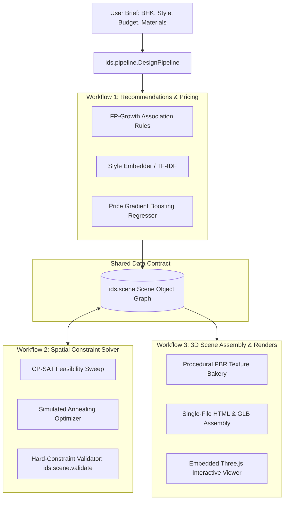

# AI Engine & 3D Solver Architecture & Conventions — InteriorAI

The **Automated Interior Design System** (`backend-ai`) is a Python 3.10+ package (`ids`) providing spatial constraint solving, associative product recommendations, price prediction regression, procedural PBR texture generation, and 3D scene assembly.

Three workflows operate off one shared scene model (`ids.scene.Scene`). Workflows 2 and 3 remain decoupled and communicate solely by reading and writing `Scene` definitions.

---

## Code Structure (`ids/`)

* [`ids/scene.py`](file:///d:/MyFiles/Interior_Design/backend-ai/ids/scene.py): Shared 2D/3D scene data contract (`Scene`, `Room`, `SceneObject`, `Opening`, `Box`). Implements hard-constraint validator (`validate()`) checking boundaries, pairwise overlaps, door swings, and window obstructions.
* [`ids/solver.py`](file:///d:/MyFiles/Interior_Design/backend-ai/ids/solver.py): Workflow 2 spatial layout solver. Implements `CPSATBackend` (OR-Tools CP-SAT integer programming) and `SweepBackend` (heuristic ray-sweep feasibility), followed by simulated annealing for aesthetic optimization.
* [`ids/models.py`](file:///d:/MyFiles/Interior_Design/backend-ai/ids/models.py): Workflow 1 data mining models. Includes FP-Growth association rules for item pairing, TF-IDF tag embeddings for style compatibility, and Gradient Boosting Regressor (`HistGradientBoostingRegressor`) for basket price forecasting.
* [`ids/history.py`](file:///d:/MyFiles/Interior_Design/backend-ai/ids/history.py): Historical sales order data adapters supporting real transaction dataframes (`from_dataframe`) and synthetic bootstrap generation (`synthetic_bootstrap`).
* [`ids/catalog.py`](file:///d:/MyFiles/Interior_Design/backend-ai/ids/catalog.py): Style taxonomies (Modern, Scandinavian, Indian Contemporary, Luxury, Mediterranean, Boho), material palettes, tiers, SKU 3D dimensions, and color families.
* [`ids/textures.py`](file:///d:/MyFiles/Interior_Design/backend-ai/ids/textures.py): Procedural PBR texture bakery synthesizing seamless base color, roughness, and normal maps for wood laminates (Oak, Teak, Walnut) and fabrics (Linen, Velvet, Woven, Leatherette).
* [`ids/export.py`](file:///d:/MyFiles/Interior_Design/backend-ai/ids/export.py): Workflow 3 3D scene assembler. Bundles geometry, textures, and camera rigs into standalone single-file HTML interactive Three.js presentations.
* [`ids/pipeline.py`](file:///d:/MyFiles/Interior_Design/backend-ai/ids/pipeline.py): Orchestration facade (`DesignPipeline`, `DesignResult`) connecting catalog, ML recommendation models, spatial solver, and export assembly.
* [`ids/service.py`](file:///d:/MyFiles/Interior_Design/backend-ai/ids/service.py): FastAPI production REST API service exposing design solving, catalog options, and system health endpoints.
* [`artifacts/latest/`](file:///d:/MyFiles/Interior_Design/backend-ai/artifacts/latest): Serialized pipeline bundle (`bundle.joblib`) and model metadata (`model.json`).
* [`build/`](file:///d:/MyFiles/Interior_Design/backend-ai/build): Precompiled catalog data blobs (`data_blobs.js`) and procedural texture definitions (`textures.json`).
* [`frontend/`](file:///d:/MyFiles/Interior_Design/backend-ai/frontend): Standalone Three.js 3D WebGL viewer client (`index.html`).

---

## Spatial Hard Constraints & Layout Rules

Spatial layout validation (`ids/scene.py` & `ids/solver.py`) enforces strict architectural safety and ergonomic clearances:

1. **Circulation Clearance (Walkways)**:
   * **Primary Circulation**: Minimum **850 mm (0.85 m)** clear walkway between major furniture pieces and entryways.
   * **Secondary Clearance**: Minimum **450 mm (0.45 m)** between complementary items (e.g., bed to nightstand, sofa to coffee table).
2. **Floor Area Utilization Cap**:
   * Furniture footprint area must not exceed **40%** of total room floor area to prevent overcrowding.
3. **Egress & Keepouts**:
   * **Door Swing Arcs**: Furniture items (except stackable rugs) must remain strictly outside the radial swing bounding box of any door.
   * **Window Glazing Keepouts**: Tall furniture pieces (> 1.1 m height) cannot overlap window wall boundaries.
4. **Boundary Containment**:
   * All furniture footprints must sit completely within room perimeter walls (inflated by a 0.04 m tolerance).
5. **Monotonic Pricing Clamping**:
   * The Gradient Boosting Regressor (GBR) price prediction is monotonic-clamped (`DesignPipeline.design`) so superset furniture baskets never quote lower than subset baskets.

---

## REST API Surface (`ids/service.py`)

* **`POST /design`**:
  * **Payload**: `DesignRequest` containing BHK, city, budget, style, wood finish, fabric, colors list, and solve flag.
  * **Response**: Feasibility boolean, tier, predicted price, recommendations list, solved 3D scene hierarchy (`rooms`, `objects`, `openings`), and zero violations guarantee.
* **`GET /options`**:
  * **Response**: Onboarding vocabulary choices for frontend customizers (styles, woods, fabrics, budgets, qualities, and supported colors).
* **`GET /health`**:
  * **Response**: Service status, model version, and loaded model metadata metrics.

---

## CI Gates & Model Verification

* **`test_solver_feasible_all_variants`**: Verifies zero hard-constraint breaches across all standard BHK room layouts (1 BHK through 5 BHK).
* **`test_price_parity`**: Ensures exported decision trees exactly match scikit-learn server inference so the browser and server quote identical figures.
* **Zero Model Alteration Guarantee**: All AI ML models, constraint solvers, GBR estimators, and texture generators are strictly preserved without unauthorized re-training or weight alterations.

---

## DOX Parent & Sibling Indices

For system architecture and sub-system guides, refer to:
* **System Architecture Specification**: [`ARCHITECTURE.md`](file:///d:/MyFiles/Interior_Design/ARCHITECTURE.md)
* **Root Project Guide**: [`AGENTS.md`](file:///d:/MyFiles/Interior_Design/AGENTS.md)
* **Backend Guide**: [`backend/AGENTS.md`](file:///d:/MyFiles/Interior_Design/backend/AGENTS.md)
* **Frontend Guide**: [`frontend/AGENTS.md`](file:///d:/MyFiles/Interior_Design/frontend/AGENTS.md)
